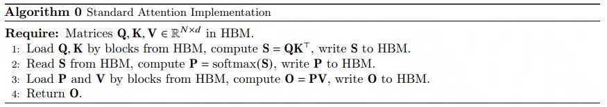
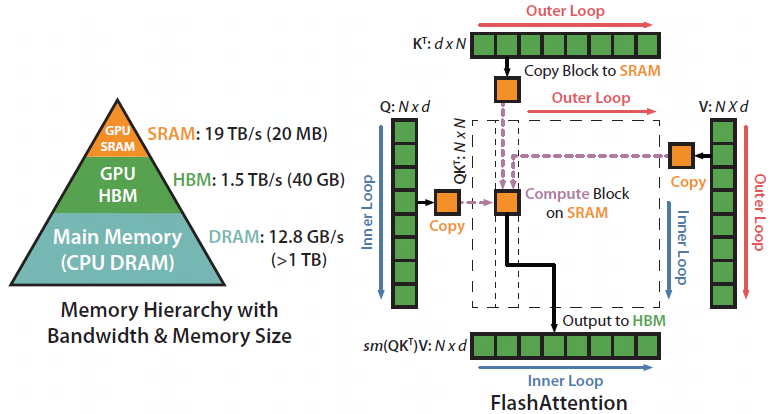

`Flash Attention` 是由StanfordAILab发表并实现的一些基于GPU底层架构实现Attention运算优化方案 (非近似算法)，其利用更少的GPU显存得到更快的运算的速率被许多企业和研究室采用，广泛应用于大多数LLM库

-----
- [Flash Attention v1](media/pdf/FlashAttention_v1.pdf)
- [Flash Attention v2](media/pdf/FlashAttention_v2.pdf)
- [Flash Attention v3](https://crfm.stanford.edu/2023/10/12/flashdecoding.html)

## Flash Attention v1
通过`Q`、`K`、`V`分块和重计算（不保存Attention的部分中间结果）的方式节省了HBM的访存次数

- [x] Attention部分显存使用数量级从平方降为线性
- [x] 最终以较少的GPU资源和更快的速度实现了与标准Attention一样的效果
- [x] 相同的GPU资源下能够训练更大的模型，取得更佳的效果表现

### 方法介绍

#### 动机

<figure markdown>
  
  <figcaption>Standard Attention算法</figcaption>
</figure>

<figure markdown>
  { width=90%, aligin=right }
  <figcaption>Standard Attention内存访问示意图</figcaption>
</figure>

Standard Attention在计算时需要读取`Q`、`K`、`V` $\in R^{N \times d}$，并读写`S`、`P` $\in R^{N \times N}$，最终输出 `O` $\in R^{N \times d}$，HMN的IO访存复杂度为$O(Nd+ N^2)$

当前主流的Attention加速算法都是近似算法，目的是减少Attention部分（计算复杂度$O(N^2d)$）的FLOPS，但是现在的GPU的浮点数计算速率比IO访存速率快得多，*过分的优化FLOPS效果不明显，依然会被IO访存速率所瓶颈*。

===> **通过修改PyTorch或Tensorflow更底层CUDA逻辑实现IO访存的优化**

#### 基本原理
1. 分块
    - 输入 `Q`分块为$T_r$个块，每个块维度$\in R^{B_r \times d}$
    - 输入 `K`, `V`分块为$T_c$个块，每个块维度$\in R^{B_c \times d}$
    - 中间值 $S_{i, j}=Q_iK_j^{T}$
    - 中间值$P_{i, j}$为$S_{i,j}$的局部`softmax`结果
    - 输出 `O` 分块为$T_r$ 个块，每个块维度$\in R^{B_r \times d}$
    - 新增额外存储空间$\ell \in R^{T_r}$，$O_i$表示`Q`分割得到$i \text{-} th$个块（即`Q_i`）的Attention分数
    - 新增额外存储空间$m \in R^{T_r}$，$m_i$表示每个$S$

2. 重计算（不保存Attention的部分中间结果）
    - 不保存$S$至HBM，减少IO
    - 不保存$P$至HBM，减少IO

## Flash Attention v2
### 方法介绍

#### 动机
#### 基本原理

## Flash Attention v3
### 方法介绍

#### 动机
#### 基本原理