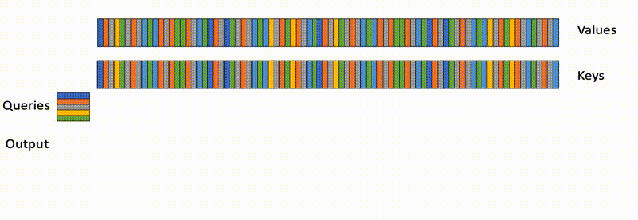
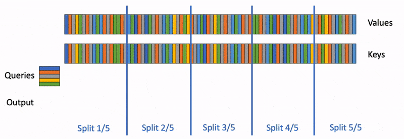

#### 底层优化方案
- [Flash Attention](Flash_Attention/FlashAttention.md)
    - v1：通过分块的方式节省了HBM的访存次数；在`batch_size`维度上并行
    - v2：减少了非矩阵乘法运算；修改`batch_size`维度并行至`seq_len`维度上并行；将分块的K、V矩阵快放入同一个thread block的不同warp中，通过共享内存的特性减少通信开销
    - v3：在Key和Value的序列长度`seq_len`上分块，进一步设置了多起点，从而新增了一个并行化操作。Q还是按照block顺序执行

<figure markdown>
  
  <figcaption>Flash Attention v1, v2运行原理图</figcaption>
</figure>

<figure markdown>
  
  <figcaption>Flash Attention v3运行原理图</figcaption>
</figure>

