### 考试形式

分批次考试，科目联考，均为机考

1. 批次一，上午场
    - 综合知识（选择题），120-150分钟
2. 批次二，下午场：科目联考，两个科目总计210分钟，可提前60分钟离场
    - 案例分析（问答题），60-90
    - 论文

| 科目 | 满分 | 合格分数线 | 特征 |
| -------- | --- | ----- | --- |
| **综合知识** | 75分 | 45分 | 75道单选题 |
| **案例分析** | 75分 | 45分 | 1必选 + 4选2 |
| **论文** | 75分 | 45分 | 4选1 |

### 考试安排

- 打印准考证：2026.5.18 9时 至 2026.5.23 8时30分
- 携带准考证和有效身份证件参与考试

### 模拟考试

### 查询成绩

一个月后查询成绩

#### 课程内容

### 软件架构设计

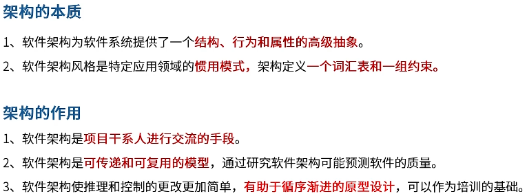

#### 软件架构风格

架构风格：是特定应用领域的管用模式。

- 数据流风格：以数据处理流程为导向（数据驱动）
    - 批处理，大量==整体==数据，无需用户交互
    - 管道-过滤器风格，==流式==数据，弱用户交互
    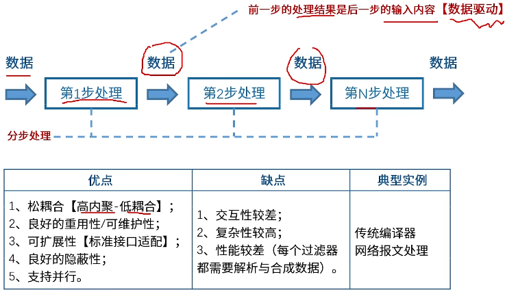
    > 常见的如传统编译：词法分析、语法分析、语义分析
- 调用返回风格：调用并返回结果，调用之间紧密联系，紧耦合
    - 面向对象
    - 主/子程序
    - 层次结构（分层越多，性能越差）
- 独立构件风格：每个构件尽可能地独立，松耦合
    - 进程通信（进程驱动）
    - ==事件驱动系统==（隐式调用）：构件之间不直接调用对方的方法，而是通过触发或广播“事件”来间接通信，以**触发**各构件相应的操作
    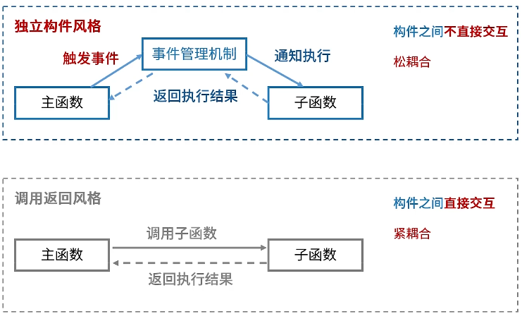
    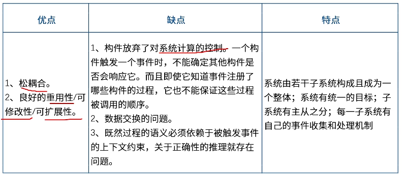
    > 常见事件驱动系统包括图形处理界面
- 虚拟机风格
    - 解释器：适合需要“自适用”的场合
    - 规则系统：适用于专家系统，核心思想是“当某些条件满足时，就执行相应的动作”（即 IF-Then 逻辑）。
    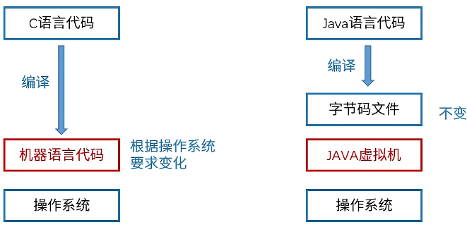
    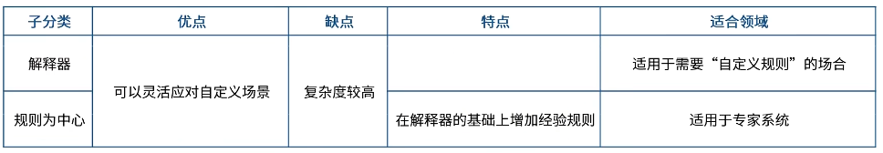
- 仓库风格：以共享数据源为中心
    - 数据库系统
    - 黑板系统：中央数据源，用于构件间共享、展示、更新信息
    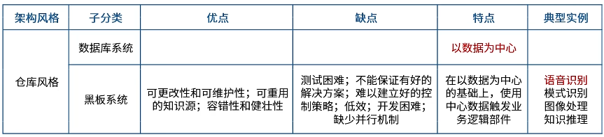
    > - 语音识别、模式识别、图像处理以及知识推理，模型参数便类似于多个专家构件，因此多个参数作用便组成黑板形式。
- 闭环控制风格，也叫过程控制
    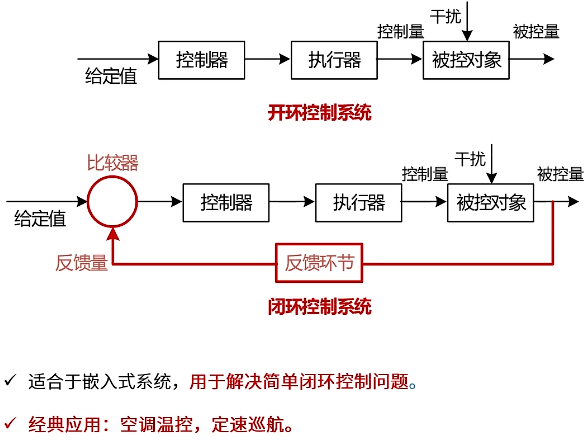
- C2风格：构件（Component）和连接件（Connector）
    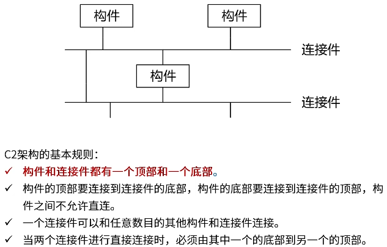

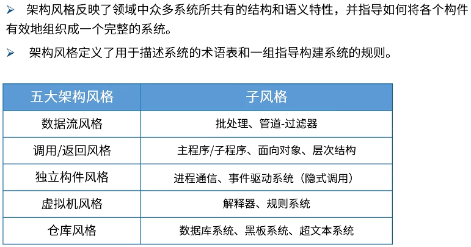
> 事实上不仅仅只用一种风格，常为应用多种风格
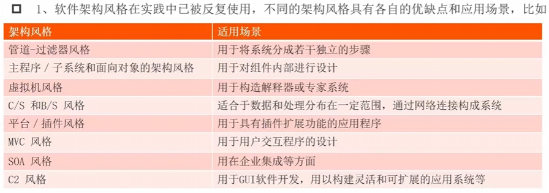

#### Web架构设计

系统架构

1. 分层架构
    - 典型应用为三层C/S架构：核心思想是将整个应用程序按职责划分为三个独立且紧密协作的层次：
       - 表示层（Presentation Layer / 客户端）
         > 常见形式：网页浏览器（如 Chrome）、手机 App、桌面软件等。
       - 业务逻辑层（Business Logic Layer / 应用服务器 → 新增的中间层）：也叫功能层，接收来自表示层的请求，进行逻辑运算，然后决定是否需要向数据层获取或存储数据。
         > 常见形式：运行在服务器上的各类后端程序
       - 数据层（Data Layer / 数据库服务器）。
         > 常见形式：各类数据库

       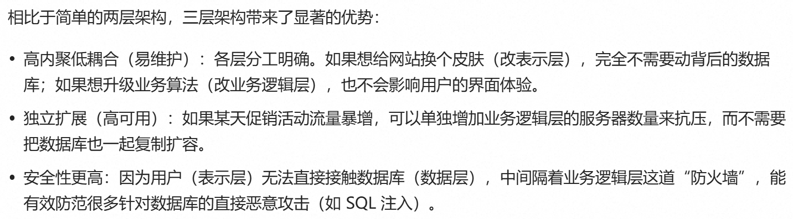
2. 事件驱动架构：核心在于“解耦”和“异步”。系统由事件生产者（发布消息）、事件通道（消息队列/代理）和事件消费者（监听并处理消息）组成。生产者只管发出事件，不关心谁在听；消费者订阅感兴趣的事件并做出响应。
3. 微内核架构（也叫做插件架构），只实现最小内核功能，剩下功能通过插件形式新增，适用于需要高度灵活扩展、允许用户自定义功能的系统。如vscode
4. 微服务架构，api访问，通过restful方式集中处理信息，再分派给分布式部署的微服务进行处理
5. 云架构

#### 架构设计方法论

- 基于架构的软件开发 （Architecture-Based Software Development，ABSD）：在软件工程领域，这是一种强调以软件架构为核心驱动力的开发方法，指导如何一步步设计出合理的系统架构。
  - 架构需求
  - 架构设计
  - 架构文档化
  - 架构复审
  - 架构实现
  - 架构演化
- 特定领域软件架构（Domain-Specific Software Architecture, DSSA）：在软件工程领域，这是一种针对特定类型任务（领域）的架构，旨在支持特定领域内多个应用的生成，从而提高软件开发的效率和复用性
  - 基本活动：领域分析（建立领域模型），领域设计（获得DSSA），领域实现（开发和组织可复用信息）。
  - DSSA角色：领域专家（有经验的用户、分析、设计、实现人员，“给建议”），领域分析人员（有经验的分析师，完成领域模型），领域设计人员（有经验的设计师，完成DSSA），领域实现人员（有经验的程序员完成代码编写）。

软件架构模型

1. 结构模型
2. 框架模型
3. 动态模型
4. 过程模型

冯诺依曼架构：
    - 存储器：包括主存（内存）和外存，CPU片上缓存为SRAM，片下缓存为Cache，主存为DRAM
    - 控制器，运算器（二者组成CPU）：CISC一条指令完成更多任务，RISC多条指令组合完成复杂任务
    - 输入设备
    - 输出设备

操作系统特征
    - 并发性：宏观上有多个程序在运行，但实际上单cpu环境下，同一时刻只有一个程序在执行
    - 共享性：操作系统上资源同时被多个并发执行的程序共同使用
    - 虚拟性：把物理实体变成逻辑上的对应物
    - 不确定性：并行执行，由于资源有限，多数情况下程序不是一贯到底运行完的，而是走走停停。

操作系统分类
    - 批处理操作系统
    - 分时操作系统
    - 实时操作系统
    - 网路操作系统
    - 分布式操作系统
    - 微型计算机操作系统
    - 嵌入式操作系统

数据库类型
    - 关系型数据库：二维表，行、列
    - 键值型数据库
    - 列存储数据库
    - 文档数据库
    - 搜索引擎数据库

直接（地址）索引：索引表直接指向物理地址
一级间接（地址）索引：索引表指向一层索引
n级间接（地址）索引：索引表指向n曾索引

嵌入式系统特点
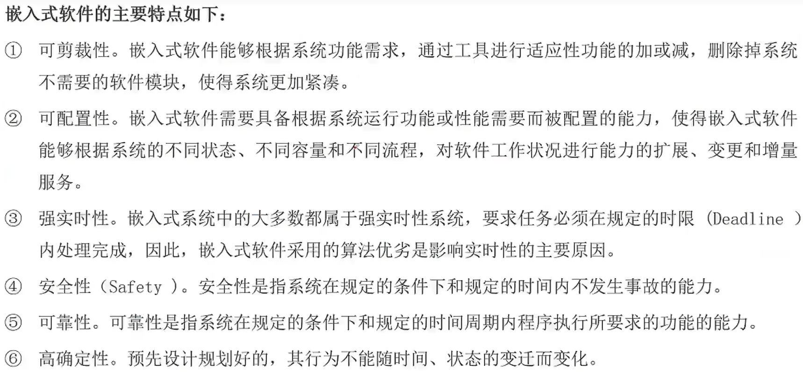

实时性：指的是系统能够在外部事件发生后，在预定的、确定的时间范围内做出正确响应的能力。

IEEE 802.3以太网结构：DMAC | SMAC | Length/Type | DATA/PAD | FCS |，分别表示目标mac地址，源mac地址，数据长度或类型（2字节，值＞1500为类型，小于1500为长度），数据或PAD填充值（加上帧头不大足64字节，通过PAD补齐），帧校验字段（Frame Check Sequence）

#### 网路协议

网络协议OSI七层架构

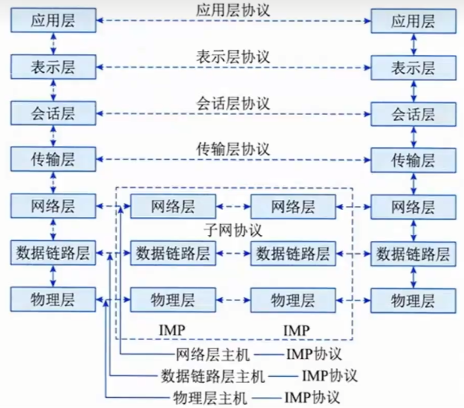

物理层，数据链数层，网络层，传输层，会话层，表示层，应用层
> 四层：应用层，传输层，网际层，网络接口层

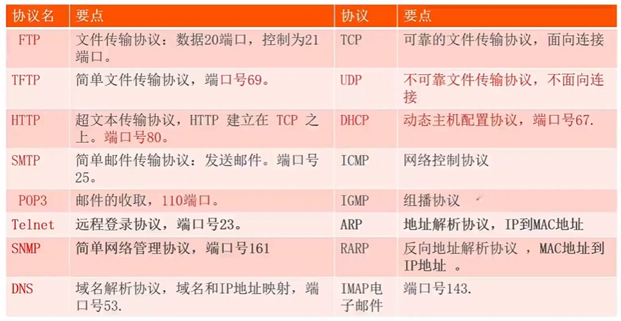

- POP3，收邮件，110端口；POP3S，端口995
- SMTP，发邮件，25端口；SMTPS，端口465；TCP连接

- DHCP(Dynamic Host Configuration Protocol动态主机配置协议)， DNS → 应用层
- TCP, UDP → 传输层
> 基于UDP协议：STDDv，VIOP，SNMP，TFTP，DNS，DHCP
- ICMP, IGMP, ARP, RARP → 网络层

物理层：集线器，中继器
数据链路层：交换机，网桥
网络层：路由器，包过滤防火墙

交换机基本原理，维护MAC地址表

- 数据转发
- 转发路径学习：转发时建立mac和端口映射表
- 数据泛洪：查表时未找到dmac，给所有端口广播（不包括源端口）
- 链路地址更新：每隔一段时间更新一次mac地址表

路由器基本原理，维护路由表

DNS协议

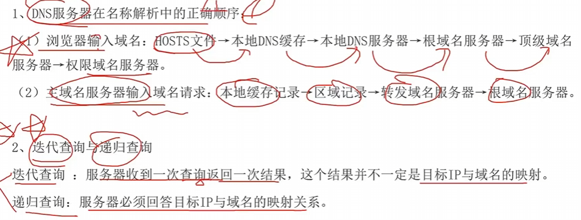

计算机语言：机器语言（二进制代码），汇编语言，高级语言

视频压缩方法：WAV，PCM，TTA，FLAC

分级存储体系：寄存器，cache，内存，外存。其中cache是为了解决高速运行的cpu与内存间速度不匹配的问题

- cache未命中时不记录读取（即cpu探寻命中时间远低于cache访存）

磁盘存取时间：寻道时间 + 旋转时间 + 读/写时间

最短移臂调度

内存三态进程状态：就绪，运行，等待
+外存（新增处于外存的静止态）五态进程状态：活跃阻塞，活跃就绪，静止阻塞，禁止就绪，运行

信号量操作：P( Proberen尝试，s=s-1)，V（Verhogen增加，s=s+1），前者尝试减少信号量，后者释放信号量

银行家算法：操作系统中避免死锁的一种经典算法，由艾兹格·迪杰斯特拉提出。它的核心思想是借鉴银行放贷的风控逻辑：系统像银行家一样，**在给进程分配资源前，先模拟计算“如果分了这些资源，系统会不会陷入不安全状态”，只有安全时才真正分配。**

奇偶校验，通信前双方约定使用奇校验还是偶校验，即约定传输的数据（包括校验位）中1的个数为奇或偶

汉明码（海明码），
- 校验位长度：需满足2^r≥r+m+1，其中r为校验位位数，m为数据位位数。
- r+m位编码总长度
- 校验码位置：2^0, 2^1, ..., 2^(r-1)

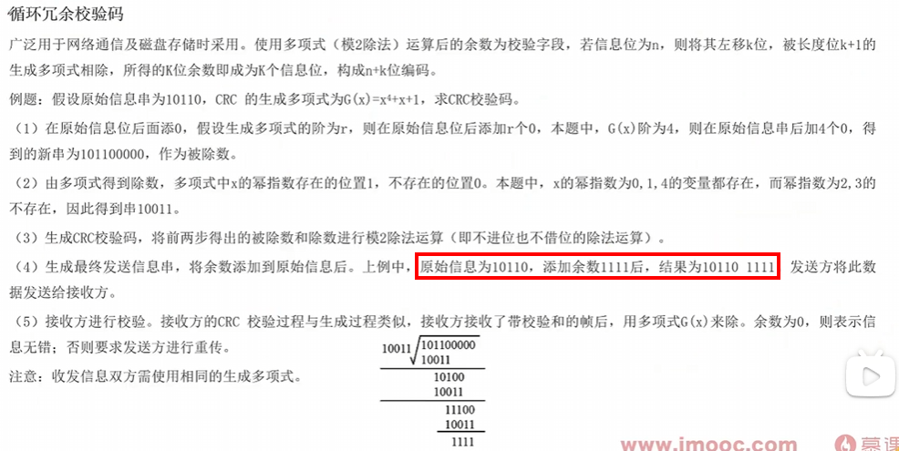

输入输出问题
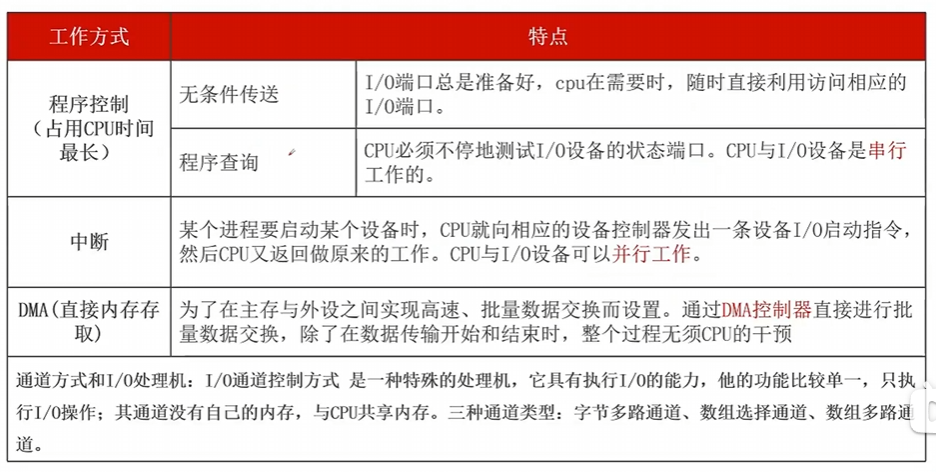

网络分层设计
- 接入层：用户接入、计费管理、MAC地址认证或过滤、收集用户信息
- 汇聚层：主要是网络访问策略控制，数据包处理和过滤，寻址，策略路由，广播域定义等功能。
- 核心层：主要是高速数据交换、高速数据传输、出口路由，常用冗余机制
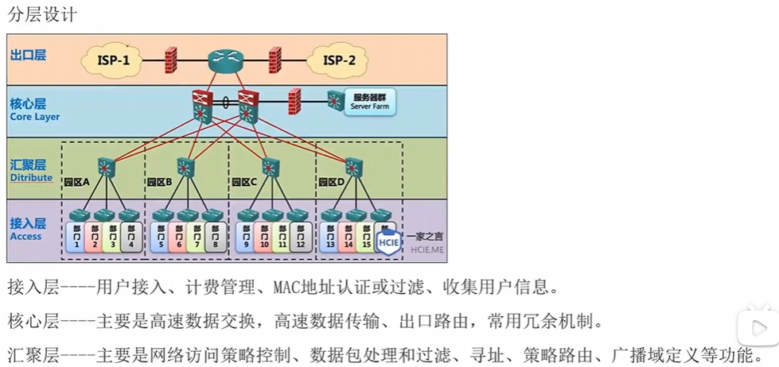

网络冗余设计：避免单点网络失效造成应用失效。有两种方式1）备用路径；2）负载分担

RAID（Redundant Array of Inexpensive Disks）便宜磁盘冗余阵列，简称为 磁盘阵列，将多个相对便宜的磁盘组合成一个磁盘组，配合数据分散排列的设计，提升数据的安全性和整个磁盘系统性能

- RAID0：数据分片并行写入，速度理论为N倍。
    > 极致性能，无保护
- RAID1：将一份数据完全一模一样地写入到两块硬盘中。互为备份，利用率50%
    > 极致安全，成本高。
- RAID2：数据位 + 循环冗余校验位 → 条带化，利用率为 r/(m+r)
- RAID3：数据位 + 奇偶校验位 → 条带化，具有专用的专用奇偶校验盘。
- RAID4：块级条带化 + 专用奇偶校验盘，具有专用的专用奇偶校验盘。
- RAID5：数据和对应的校验信息被分散存储在所有硬盘上（分布式奇偶校验）。如果某一块硬盘坏了，可以通过剩下硬盘里的数据和校验信息，反向计算出丢失的数据。最少3块硬盘，利用率为(n-1)/n
    > 均衡之选，性价比之王。与RAID3具有专用奇偶校验盘，而RAID5的校验信息是分散在各盘中的。
- RAID6：双重分布式奇偶校验。在 RAID 5 的基础上增加了一套校验信息，相当于有两份“备用图纸”。最少4块硬盘，利用率为(n-2)/n
    > 双重保险，大容量首选
- RAID10（1+0，不是10）：先把硬盘两两配对做成镜像，然后再把这些镜像组做成条带化并行写入。空间利用率只有 50%。
    > 土豪的选择，又快又稳

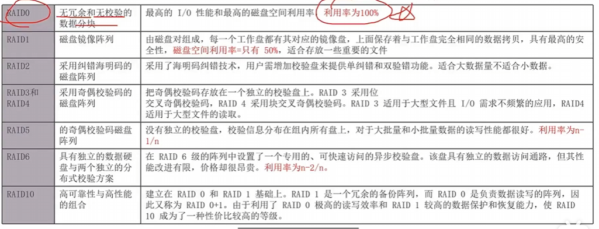

#### 系统工程

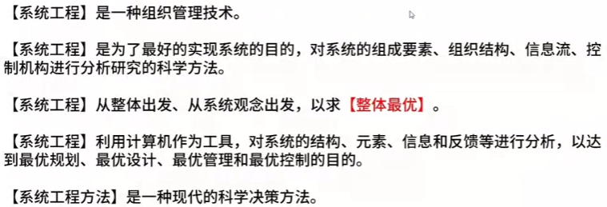

系统工程方法
- 霍尔三维结构（“硬科学”方法论）
    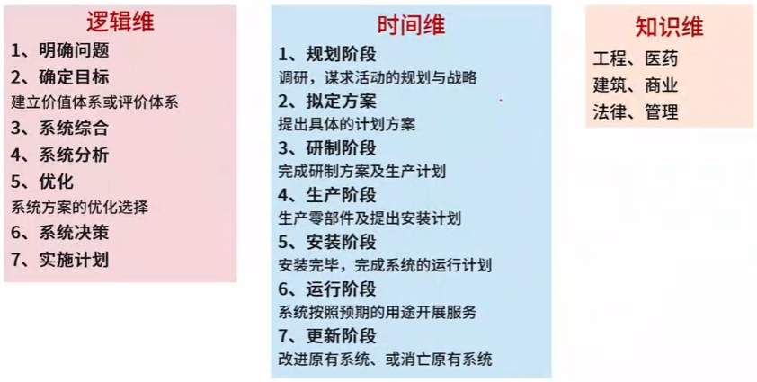
- 切克兰德方法（“软科学”方法论）

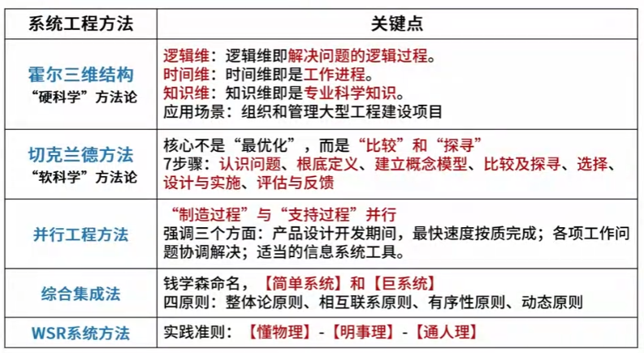
> W(uli)S(hili)R(enli)

系统工程生命周期阶段
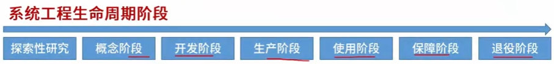

系统工程生命周期方法
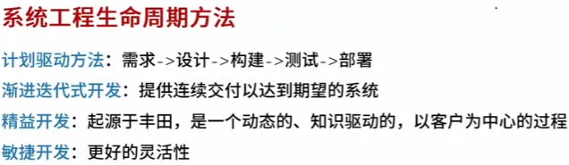

#### 信息系统

信息系统生命周期
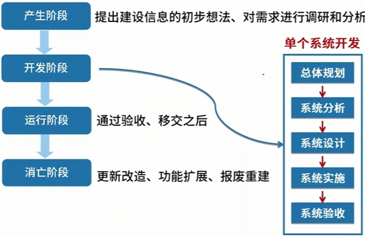

信息系统建设原则

- 高层管理人员介入原则：如首席信息官（Chief Information Officer, CIO）介入
- 用户参与开发原则：用户确定范围、核心用户全程参与、用户深度参与
- 自顶向下规划原则：以此减少信息不一致的现象
- 工程化原则：引入【软件工程】
- 其他原则，如创新性原则，整体性原则，发展性原则以及经济性原则

信息系统开发方法

- 结构化方法：自顶向下，逐步求精，应变能力较差
    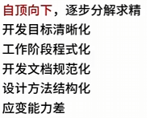
- 面向对象：自底向上，阶段界限不明，更符合人的思维习惯，更好应变
    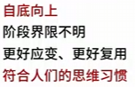
- 面向服务的方法：本质上是在面向对象基础上进一步调整变化
    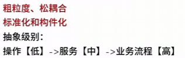
- 原型方法：可以作为上述所有方法在需求阶段的侧面补充
    > 功能划分：水平原型，如界面；垂直原型，如复杂算法
    > 结果划分：抛弃原型；演化原型
- 形式化方法：数学模型化，所有东西均可证明/验证，而不是测试
- 统一过程方法UP
- 敏捷方法

结构化建模方法，基本工具是数据流图（ DFD）
信息建模方法，基本工具是实体联系图（ ERD）
面向对象建模方法，形成了面向对象的建模标准，即 UML （统一建模语言）

信息系统开发方法

1．计算无关模型（ Computation Independent Model , CIM）
CIM 对系统中使用的重要的领域抽象进行建模，因此有时被称为领域模型。
2．平台无关模型（ Platform - Independent Model , PIM）
PIM 在不涉及实现的情况下对系统的运转进行建模。
3．平台相关模型（ Platform - Specific Model , PSM）
PSM 是对平台无关模型转换后得到的，对于每个应用平台都有一个单独的 PSM 。

信息系统的分类
- 业务处理系统（Transaction Processing System，TPS），又称为电子数据处理系统（Electronic Data Processing System，EDP）
    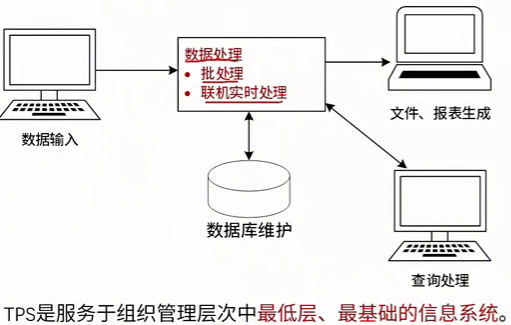
- 信息管理系统（Manage Information System，MIS），是由TPS发展而来。MIS系统四大部件：信息源，信息处理器，信息用户和信息管理者。
    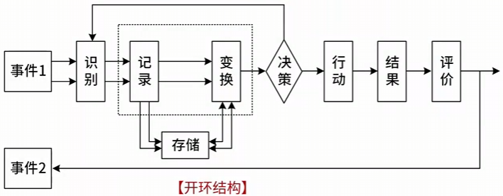
    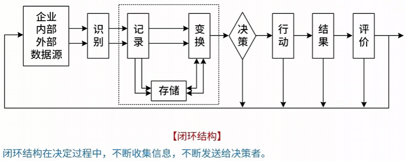
    > 开、闭环的结构区别为是否有循环迭代过程
    > 数据处理中批处理系统为开环结构；数据处理中计算机实时处理系统为闭环系统。
- 决策支持系统（Dicision Support System，DSS），由语言系统、知识系统和问题处理系统3个互相关联的部分组成。
    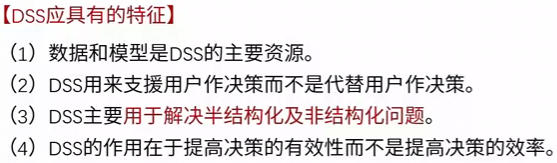
- 专家系统（Expert System，ES），是一个智能计算机系统，其内包含某个领域具有专家水平的大量知识和经验，能够利用人类专家的知识和解决问题的方法来处理该领域的问题。
    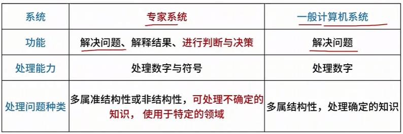
    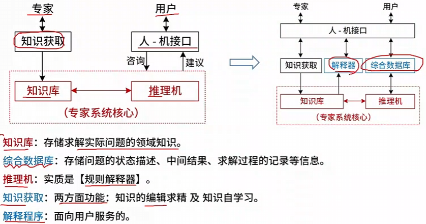
- 办公自动化系统（Office Automation System，OAS）
- 企业资源计划（Enterprise Resource Planing，ERP）
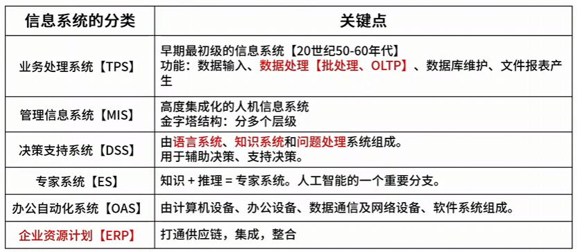

#### 政务信息化与电子政务

电子政务主要有3类角色：政府（Government），企（事）业单位（Business）及公民（Citizen）
> 如果有第4类就是公务员（Employee）

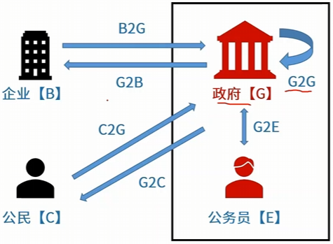

#### 企业信息化与电子政务

信息化的概念

- 主体是全体社会成员（政府、企业、团体和个人）
- 时域是长期过程
- 空域是经济和社会的一切领域
- 手段是先进社会生产工具
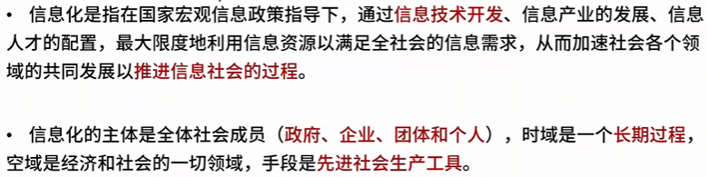

企业信息化目的，涉及三类创新

- 技术创新
- 管理创新：转向技术、物资、人力资源的管理，并延伸到企业技术创新
- 制度创新

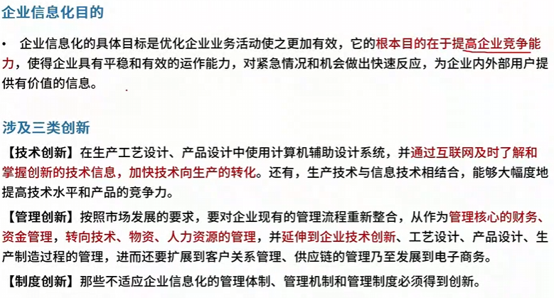

组织对信息化的需求是组织信息化的原动力。信息化需求从高到低具有3个层次↓
- 战略需求
- 运作需求
- 技术需求

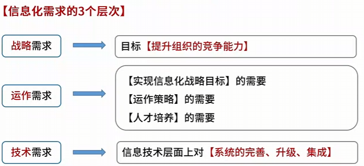

企业信息化方法
- 业务流程重构方法
- 核心业务应用方法
- 信息系统建设方法
- 主题数据库方法：整合核心业务的数据库，消除“信息孤岛”
- 资源管理方法：切入点是为企业资源管理提供强大的能力。如ERP、SCM、CRM
    - 企业资源计划（Enterprise Resource Planning，ERP）
      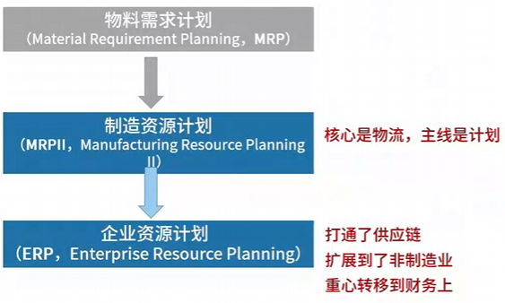
    - 客户关系管理（Customer Relationship Management，CRM），目的是提高收入，核心思想是以客户为中心
      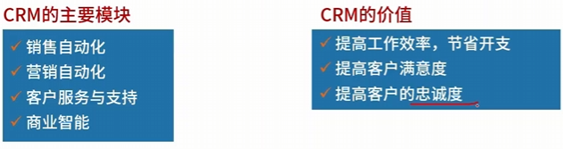
    - 供应链管理（Supply Chain Management，SCM），理念为强强联合
      > 三流：信息流（又细分为需求信息流，即需方到供方；供应信息流，即供方到需方），现金流，物流
      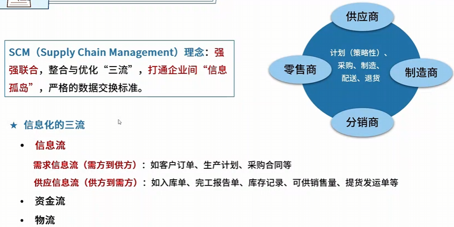
- 人力资本投资方法：把一部分企业的优秀员工看作是一种资本
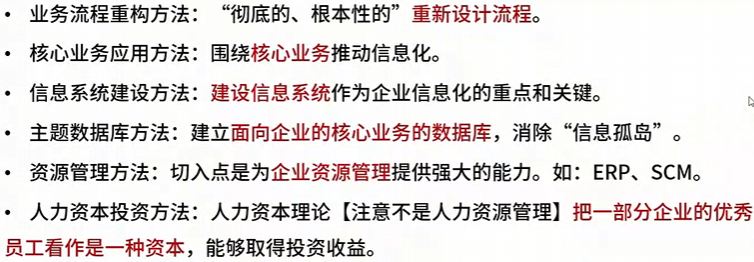

信息系统的战略规划

- 第一阶段：以数据处理为核心，包含以下常用方法
  - 关键成功因素法（Critical Success Factors，CSF）
    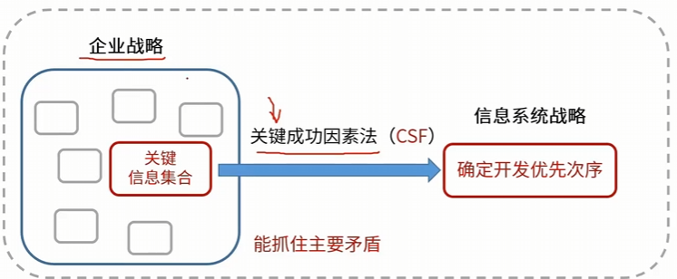
  - 战略集合转化法（Strategy Set Transformation，SST）
    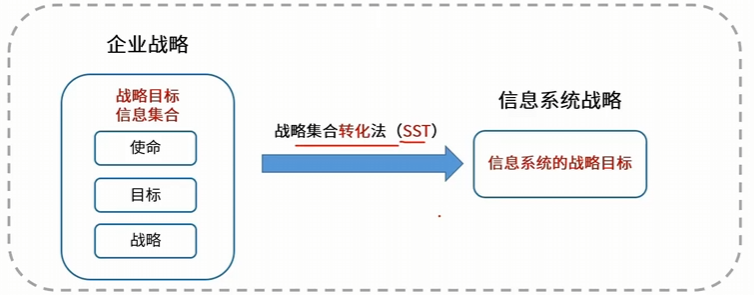
  - 企业系统规划法（Business System Planning，BSP），自上而下的规划 + 自下而上的实现。其中U/C矩阵（Use/Create Matrix） 是核心工具，主要用于定义信息系统总体结构和划分子系统。
    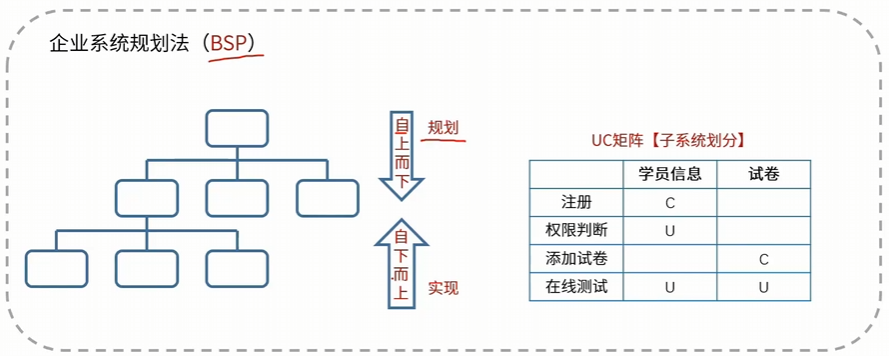
  > 三个方法可以综合使用，统称为BCS
- 第二阶段：以企业内部MIS为核心
- 第三阶段：以集成为核心
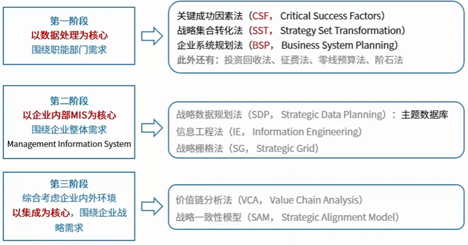

企业信息化体系
- 商业智能
    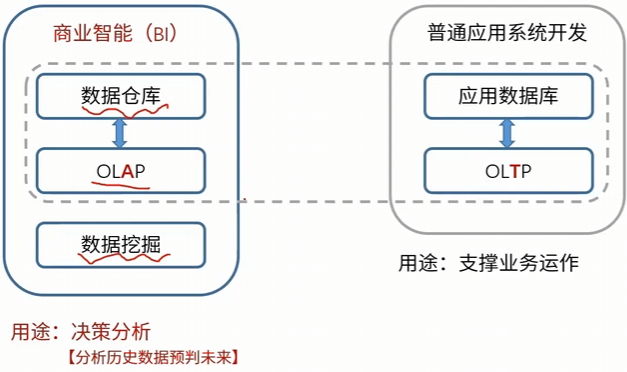
- 数据仓库
    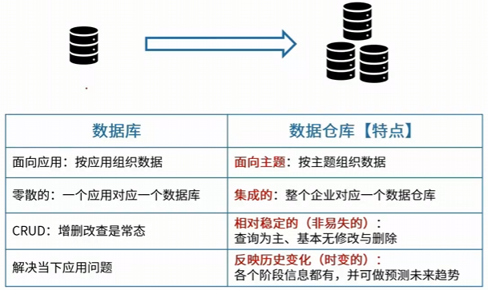
    
- 数据挖掘：利用隐藏的知识做分析与预测。分类方法包括关联分析，序列模型分析，分类分析，聚类分析
    
- 数据湖，既支持分析处理，也支持事物处理
    
    
- 业务流程再造（Business Process Reengineering，BPR）和业务流程管理（Business Process Management，BPM）
    
    > PDCA：P(lan)、D(o)、C(heck)、A(ct)
- 企业应用集成（Enterprise Application Integration，EAI）：没有统一的标准，常用方法包括：表示集成（集成界面）、数据集成（集成数据）、控制集成（集成应用逻辑）以及业务流程集成（集成应用逻辑并考虑业务优化）
    
    
    
- 企业门户
    
- 企业应用集成
    

> 联机分析处理（On-Line Analytical Processing，OLAP）；联机事务处理（On-Line Transaction Processing，OLTP）

电子商务类型：主要有两类角色，即企业Business和个人Customer 

> O2O，线上支付，线下体验，如团购

数字化转型，包括五个发展阶段，即初始级、单元及、流程级、网络级以及生态级


智能制造体系


遗留系统演化策略象限


程序流程图环形复杂度：V(G) = Edges - Nodes + 2，Nodes包括输入节点和输出节点，Edges包括入边和出边

#### 项目管理

盈亏平衡分析

> 可变成本与销售额是成比例的，因此可以根据销售额和可变成本算出比例

进度管理，也称时间管理
- 进度管理
    - 单代号网络图，前导图Precedence Diagramming Method
        
    - 甘特图Gannt
        


> WBS：Work Breakdown Structure工作分解结构

影响软件质量的3组因素


软件质量控制与软件质量保证
- 质量控制Quality Control，QC
- 质量保证Quality Assurance，QA


软件能力成熟度模型集成（Capability Maturity Model Integration，CMMI）


软件配置管理
- 基本配置项为可交互成果
- 版本控制：追踪文件变更
- 变更控制：管理变更，保证变更有进行
    


软件工具


#### 传统软件开发模型

软件开发生命周期（Software Development Life Cycle，SDLC）使用的模型，也叫软件开发模型，软件过程模型

- 瀑布模型：顺序开发模型，严格区分阶段，每个阶段因果关系紧密相连
    
- V模型（瀑布模型变种），搭配[软件测试](#软件测试)理解：需求分析→系统测试，验收测试；概要设计→集成测试；详细设计→单元测试。
    
- 原型Prototype模型：根据一个简易原型来完善需求分析、软件设计和程序设计部分，后续虚线阶段不一定执行
    > 包括【抛弃型原型】和【演化型原型】
    
- 螺旋模型：以快速原型为基础+瀑布模型，每一圈都是一轮瀑布模型，并额外考虑了风险问题
    
- 迭代与增量：增量为增加；迭代为完善优化，填充轮廓。
    
- 构件组装模型
    
    基于构件的软件工程（Component-Based Software Engineering，CBSE）：构件的组装方式包括顺序组装，层次组装以及叠加组装。组装可能出现参数不兼容、操作不兼容、操作不完备3种不兼容情况。
    
- 快速应用开发模型（Rapid Application Development，RAD）：瀑布模型 + CBSE基于构件组装的软件工程
    
- 软件开发过程模型，也叫统一过程（Unified Process，UP）：用例驱动
    > Rational Unified Process，RUP即为 Rational 软件公司推出的一套非常经典且详尽的软件工程过程框架
    

!!! info
    - 瀑布模型每个阶段一次性完成该阶段所有工作，实际上太现实，因此该模型开发成功率较低，只适合需求明确、完整以及正确的项目；严格串行化，很长时间才能看到结果；
    - 原型模型适合不明确需求的项目

#### 敏捷方法
    
敏捷方法：适应性的（而不是预设性），以人为本，增量迭代，小步快跑，适合小型项目以及需求变化大、需求不清晰的项目


- 敏捷方法-XP（E**x**treme **P**rogramming）极限编程：注重面对面沟通，目的是如何写出高质量代码
    > 结对编码：一个人写代码，另一个人立马审代码
    
- SCRUM：是一套教团队“如何高效协作和管理项目进度”的作战地图
    
- 水晶系列方法
- 特征驱动开发方法（Feature-Driven Development，FDD）：开发人员分类
- 开放源码：程序开发人员在地域上分布很广，不集中办公。


#### 逆向工程

指在没有原始源代码或设计文档的情况下，通过分析已有的可执行程序（二进制文件），反向推导出软件的结构、算法、设计原理和业务流程的过程。整体来说是设计的恢复过程。


#### 需求工程

包括需求开发（需求获取，需求分析，需求定义以及需求验证）和需求管理


> Software Requirements Specification，SRS软件需求规格说明书

**需求开发**

- 需求获取：分层部分依次从抽象到物理实际实现
    
    
- 需求分析，结构化分析（Structured Analysis，SA）
    - 功能模型：（分层）数据流图（Data Flow Diagram，DFD）
    - 行为模型：状态转换图（State Transition Diagram，STD）
    - 数据模型：实体联系图（Entity-Relationship Diagram，ERD）
    - 数据字典：
    
- 需求分析，面向对象分析（Object-Oriented Analysis，OOA）
    - 事物：结构事物，行为事物，分组事物，注释事物
    
- 需求定义：将需求分析的成功落地成文档
    - 严格定义法：所有需求的能被预定义
    - 原型法：并非所有需求都能在开发前被准确说明
    
- 需求验证：已经完成规则说明书，进行需求复审，对齐确认达成共识，形成需求基线
    

**需求管理**

- 需求跟踪
    
    > FR: Functional Requirement

- 需求变更
    
    > 变更请求需要变更控制委员会（ Change Control Board，CCB）审批

#### UML

Unified Modeling Language统一建模语言（平台无关、语言无关），包含以下14种经典图形

静态图（结构图）

- 类图：展示系统中的类、接口、属性、方法以及它们之间的静态关系（如继承、关联）
- 对象图：展示在某一特定时刻，系统中实际存在的对象实例及其具体的属性值和相互关系。可以看作是类图在某一刻的“照片”。
- 构件图：描述系统中各种软件构件（如库文件、可执行程序、功能模块）的组织结构及其依赖关系。常用于模块化设计和代码复用分析。
- 部署图
- 制品图
- 包图：将相关的类、接口等元素打包成组（类似文件夹），展示包与包之间的依赖和层次关系。常用于大型系统的架构分层和命名空间管理。
- 组合结构图：深入到一个复杂类或构件的内部，展示其内部的部件（Parts）、端口（Ports）以及它们之间如何通过连接器进行协作。

动态图（行为图）

- 用例图
- 顺序图（序列图）：按对象交互的时间顺序一步步完成通信（垂直生命线，水平信息流）
- 通信图（协作图）：强调发送和接收消息的对象之间的空间连接关系。它不强调绝对的时间轴，而是通过消息编号来体现顺序。适合看清“哪些对象需要相互通信”。
- 状态图
- 活动图
- 定时图
- 交互概览图
    > 与顺序图、通信图和定时图统称为交互图

4+1视图


- 逻辑视图logical view：系统分析、设计人员
- 实现视图implementation view
- 进程试图process view
- 部署视图deployment view
- 用例视图use-case view

#### 软件系统建模


常见方法有：

- 结构化建模方法：绘制的模型称为数据流图DFD
- 信息工程建模方法（或数据库建模方法）：创建的模型称为实体联系图ERD
- 面向对象建模方法：使用UML定义不同类型的模型图，共建一个信息系统或应用系统

#### 人机界面设计


#### 结构化设计

内聚程度↓：
- 偶然内聚
- 逻辑内聚
- 过程内聚
- 时间内聚
- 通信内聚
- 顺序内聚
- 功能内聚


耦合程度↓：
- 无直接耦合
- 数据耦合
- 标记耦合
- 控制耦合
- 通信耦合
- 公共耦合
- 内容耦合


- 扇入，也可以理解为入扇（Fan-in）： 指有多少个上级模块直接调用了当前模块。
- 扇出，也可以理解为出扇（Fan-out）： 指当前模块直接调用了多少个下级模块。

> 扇：像扇子一样打开，表示一对多的关系或多对一的关系


#### 面向对象设计

类的分类


基本过程


（7大）设计原则


- 李氏替换原则：子类不能随意重写父类方法

#### 数据库

三级模式

- 概念模式：也称作模式，全体数据的逻辑结构和特征的描述。一个数据库只有一个概念模式
- 外模式：也称作子模式、用户模式、逻辑模式，用以描述用户看到或使用的部分数据的逻辑结构。
- 内模式：也称作物理模式，定义存储记录的类型、存储域的表示以及存储记录的物理顺序，如引元、索引和存储路径等。一个数据库只有一个内模式。

> 外模式/模式：逻辑独立性
> 内模式/模式：物理独立性

数据库设计阶段

- 属性冲突：属性值或属性域冲突
- 命名冲突：同名异义，异名同义
- 结构冲突：统一对象在不同应用中抽象不同（A应用中是姓名，B应用中是名称）；同一实体在不同ER图中属性个数和排列次序不同


数据库备份及故障恢复


事务管理的ACID属性
- Atomicity原子性：操作要么不做，要么全做
- Consistency持久性：数据从一个一致性状态变道另一个一致性状态
- Isolation隔离性：不能被其他事务干扰
- Durability持久性：一旦提交，改变就是永久的

Redis值数据类型


- 缓存击穿：查询发现不在高速缓存中，要进一步访问低速数据库


#### 关系（数据库）模式

集合运算符：∩（行交）∪（行并）-（行减交）×（笛卡尔乘积）÷（象集，含有相同属性值域的其他属性）

> 左/右外连接允许右/左表其他属性为空值

关系模式（Relation Schema）简单来说就是数据库中“表的结构定义”。它是对一张二维表的完整描述，决定了这张表有哪些列、每列是什么类型以及列之间有什么规则。

- 关系名R：表名
- 属性名U：列名
- 域D：每个属性的取值范围
- 完整性约束：必须遵守的数据规则，如学号不能重复，外键必须是已存在主键

范式{1NF：确保原子性，2NF：消除部分依赖，3NF：消除传递依赖，BCNF：所有属性都是候选码的组成成分}
- 原子性：1）每个单元格只能有一个值，如所选课程为“数学，物理”即破坏了原子性；2）无重复列属性，如电话1，电话2等
- 消除部分依赖：在1NF的基础上增加约束，即所有非主键字段都必须完全依赖于整个主键，而==不能只依赖于主键的一部分==。
- 消除传递依赖：在2NF的基础上增加约束，即所有非主键字段都必须直接依赖于主键，而不能通过其他非主键字段间接依赖（不能存在A→B→C）。

ArmStrong公理

- 增广率：X→Y，Z⊆U ==> XZ→YZ
- 合并规则：X→Y，X→Z  ==> X→YZ
- 伪传递规则：X→Y，WY→Z ==> XW→Z
- 分解规则：X→Y，Z⊆Y ==> X→Z

数据库反规范化设计：通过牺牲规范化的方式提升性能

- 增加冗余列
- 增加派生列
- 重新组表
- 分割表

#### 软件测试

白盒：又称结构测试、透明盒测试、逻辑驱动测试或基于代码的测试。测试人员必须了解程序的内部结构和处理过程。

- 基本路径测试
- 循环覆盖测试
- 逻辑覆盖测试

> 条件组合覆盖关注的是局部判定条件的排列组合，而路径覆盖关注的是程序全局的执行流程。

黑盒：不考虑程序内部结构和处理过程，只在软件接口处进行测试

- 等价类划分
- 边界值分析
- 错误推测
- 因果图

灰盒：介于黑盒和白盒测试之间的测试

!!! info
    - 黑、白、灰盒测试均属于动态测试
    - 静态测试：被测试程序不在机器上运行，而采用人工检测和计算机辅助分析的手段对程序进行监测

按照测试的目的、阶段的不同（搭配[V模型](#传统软件开发模型)理解），把测试分为

- 单元测试
    
- 集成测试
    
- 确认测试
    
- 系统测试
    

其他测试
- 压力测试：系统确定的瓶颈下测试
- 负载测试：超负荷情况下测试
- 强度测试：在==系统资源特别低==的情况下考查软件系统极限运行情况。本题第一空选择A选项。
- 容量测试：并发测试也称为容量测试，主要用于测试系统可同时处理的在线最大用户数量。


#### 质量属性效用树

utilty tree四大特性
- 性能
- 安全性
- 可用性
- 可修改性

（1）性能：代表参数（响应时间、吞吐量），设计策略（优先级队列、资源调度）。

（2）可用性：尽可能少的出错与尽快的恢复。代表参数（故障间隔时间，故障修复时间），设计策略（冗余、心跳线）。

（3）安全性：破坏机密性、完整性、不可否认性及可控性等特性。设计策略（追踪审计）

（4）可修改性：新增功能多少人·月能完成，设计策略（信息隐藏）

#### 数据流图

DFD分层细化过程遵循的数据平衡原则：
- 父子图平衡（层间平衡）：父图中某个加工的输入和输出数据流，必须与其子图（细化图）的输入和输出数据流在数量和内容上完全一致。
- 数据流守恒（层间守恒）：每一个加工的所有输出数据流中的数据必须从该加工的输入数据流中直接获得或能通过该加工的处理而产生


#### 架构评估

- （Architecture Trade-off Analysis Method，ATAM）架构权衡分析法：多属性权衡、风险与敏感点
    > 风险点是一个或多个构件的特性
- （Scenarios-based Architecture Analysis Method，SAAM）基于场景的架构分析法：可修改性、架构对变更的适应性

风险点：系统架构风险是指架构设计中潜在的、存在问题的架构决策所带来的隐患。

非风险点：一般以某种做法，“是可以实现的”、“是可以接受的”方式进行描述。

敏感点：指为了实现某种特定的质量属性，一个或多个构件所具有的特性。

权衡点：影响多个质量属性的特性，是多个质量属性的敏感点。

场景是从风险承担者（利益相关者）的角度对系统交互的描述

#### 其他概念

- 构件和连接件、中间件
- 面向对象建模技术（Object Modeling Technique， OMT）：
  - 对象模型/静态模型：类图
  - 动态模型/行为模型：状态（转换）图
  - 功能模型：数据流图
  - 数据模型：E-R图

- 架构风格优劣势及擅长应用场景，性能特点

> 可根据特点推出优劣势

- 基准测试程序benchmark：应用程序中用得最多、最频繁的那部分核心程序作为评估计算机性能的标准程序。
- [177]--25-4  → 25-8
- 实体完整性：主键不为空；参照完整性：类似于外键一定存在或为空；用户定义完整性：数据符合约束。
- 产品配置项：1）属于产品组成部分的工作成果，如需求文档，设计文档，源代码和测试用例；2）属于项目管理和机构支撑过程域产生的文档，如工作计划，项目质量报告和项目跟踪报告等。

软件架构复用
- 机会复用
- 系统复用


#### 论文相关

- 构件库的建立
