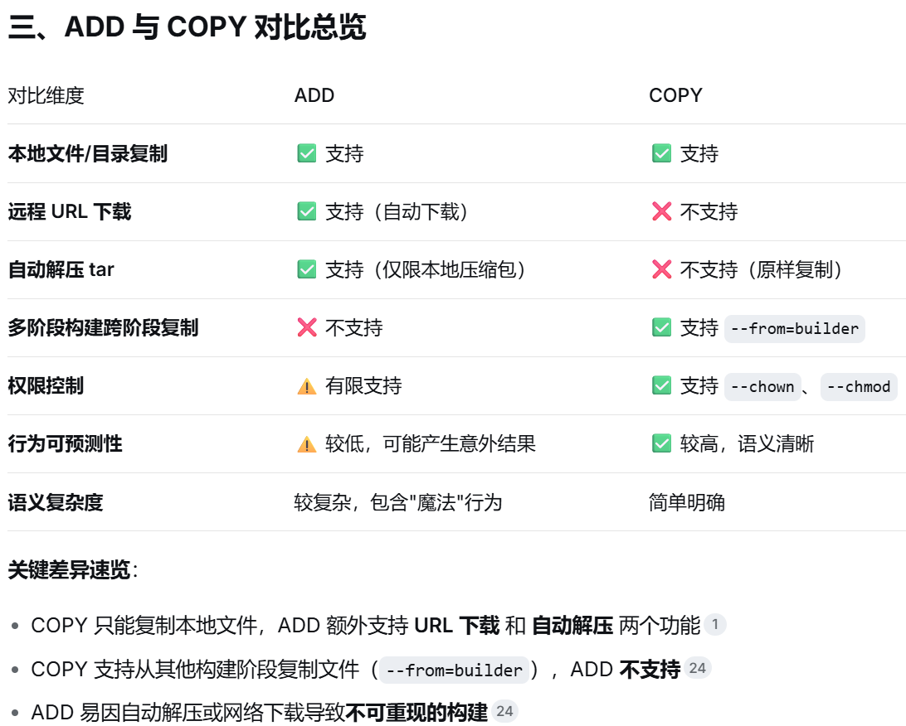

#### 安装docker

- 更新wsl系统：`wsl --update --web-download` 
- 安装Docker：`"Docker Desktop Installer.exe" install --installation-dir=E:\Docker\Desktop --wsl-default-data-root=E:\Docker\DockerDesktopWSL --windows-containers-default-data-root=E:\Docker\Containers`，具体参数如下

    - 指定安装路径：`--installation-dir=install_absolute_dir`
    - 指定镜像存储路径（需与安装路径不同）：`--wsl-default-data-root=wsl_absolute_dir\DockerDesktopWSL`
    - `--windows-containers-default-data-root=containers_absolute_dir`

    !!! info
        若未弹出安装页面，可能是历史安装时使该文件夹需要管理员权限才能写入，需删除该文件夹后再重新安装。

- 配置Docker引擎加速器（可通过切换源的顺序，实现pull）

    ```json
    "registry-mirrors": [
        "https://docker.xuanyuan.me"
    ]
    ```

    1. [`登录SWR`](https://support.huaweicloud.com/usermanual-swr/swr_01_0022.html)
    2. 选择区域局点：华东-上海
    3. 左侧镜像资源 → 镜像中心 → 右上角镜像加速器 →加速器地址
    4. 复制至 `#!json "registry-mirrors": [url]`  

- 汉化
    1. [`汉化包release地址`](https://github.com/asxez/DockerDesktop-CN/releases)
    2. 选择指定版本
    3. 替换`~/frontend/resources/app.asar`

### 信息查看

#### `version`

`#!bash docker version` 查看docker版本及desktop版本

#### `info`

`#!bash docker info` 查看docker详细信息，包含

- 容器信息
- 镜像信息
- 版本信息
- 镜像引擎加速器配置信息

### Dockerfile

用于定义镜像构建流程的文本配置文件，通过 [`docker build`](#build) 命令可读取指定 Dockerfile 文件内容构建镜像

#### 常用关键字

每个执行一次条`RUN`、`COPY`或`ADD`就会加一层（Layer），建议尽量压缩`RUN`命令，以减少元数据开销。>出于规范和可读性考虑关键字全大写

=== "FROM"
    指定基础镜像，必须是 Dockerfile 的第一条指令（支持使用多个基础镜像进行多段构建）。
    ```yaml
    # 第一阶段
    FROM node:22.15.1-slim AS builder
    ...
    # 第二阶段
    FROM nginx:alpine
    ## 表示将第一阶段镜像中的 `/app/dist` 文件夹复制到当前镜像目录下 `/usr/share/nginx/html`
    COPY --from=builder /app/dist /usr/share/nginx/html
    ```
=== "WORKDIR"
    设置工作目录，后续的 `RUN`、`CMD`、`ENTRYPOINT`、`COPY`、`ADD` 都会在该目录下执行。不存在时会自动创建
    ```yaml
    WORKDIR /app
    ```
=== "RUN"
    在镜像构建时执行命令（如安装软件、创建目录）。每个 `RUN` 会创建一个新层，推荐合并命令以减少层数
    ```yaml
    RUN apt-get update && \
        apt-get install -y --no-install-recommends ffmpeg && \
        rm -rf /var/lib/apt/lists/* && \
        apk add --no-cache openssl && \
        mkdir -p /etc/nginx/certs && \
        openssl req -x509 -nodes -days 365 -newkey rsa:2048 \
        -keyout /etc/nginx/certs/server.key \
        -out /etc/nginx/certs/server.crt \
        -subj "/CN=localhost"
    ```
=== "COPY"
    将构建上下文中的文件/目录复制到镜像内。支持通配符，也支持 `--from` 实现多阶段复制
    ```yaml
    # 将宿主机文件复制到镜像内
    COPY nginx.conf /etc/nginx/conf.d/default.conf
    # 历史阶段文件复制到镜像内
    COPY --from=builder /app/dist /usr/share/nginx/html
    ```
=== "ADD"
    在绝大多数情况下优先使用 `COPY` 关键字
    <div class="one-image-container">
        
        <p style="text-align: center;">图片标题</p>
    </div>

=== "ENV"
    设置环境变量，这些变量在构建阶段和容器运行阶段均可用。 ==ENV变量会占用镜像层空间==
    > 构建时无法覆盖，运行时可通过 `docker run -e var_name=value` 方式覆盖默认值
    ```yaml
    ENV APP_HOME /app
    ENV VERSION=1.0.0 DEBUG=false   # 使用空格分隔多变量声明
    WORKDIR $APP_HOME
    RUN echo "Version: $VERSION" > version.txt
    CMD ["sh", "-c", "echo $DEBUG"]
    ```
=== "ARG"
    定义仅在构建阶段（`docker build`过程）有效的变量，用于参数化 Dockerfile。==ARG变量不会占用镜像层空间==
    > 构建时可通过 `docker build --build-arg var_name=value` 方式覆盖默认值
    ```yaml
    ARG ARG_NAME            # 声明变量不赋值，通过build-arg传入参数
    ARG USERNAME=xcluo
    RUN adduser --disabled-password $USERNAME
    ```
=== "CMD"
    作为镜像在容器启动时默认的执行命令（可被 `docker run` 的参数覆盖）。每个 Dockerfile 只能有一条 CMD，多条则只有最后一条生效
    ```yaml
    CMD ["gunicorn", "main:app", "-w", "4", "-k", "uvicorn.workers.UvicornWorker", "-b", "0.0.0.0:8000"]
    ```
=== "ENTRYPOINT"
    指定容器入口命令，在 `CMD` 前先执行，且不容易被覆盖
=== "VOLUME"
    声明容器中的某个目录作为数据卷，将容器内指定的路径标记为持久化存储点，以便数据可以在容器重建、更新或删除后依然保留，或者实现容器间数据共享。（镜像不删除就不会有问题）
    > 尽量不在 Dockerfile 中硬编码 VOLUME，更建议在 `docker run` 或 `docker-compose` 中显式创建命名卷
    ```yaml
    VOLUME /var/log /var/data
    ```
=== "USER"
    指定运行容器时使用的用户名或 UID以及可选的用户组或 GID。
    > 切换用户的前提是该用户在镜像中存在，因此在切换之前常执行 `RUN useradd -m user_name` 创建用户操作。
    ```yaml
    RUN addgroup -g 1001 -S appuser && \
    adduser -S appuser -u 1001 -G appuser
    COPY --chown=appuser:appuser . .        # --chown 更改文件拥有者
    USER appuser
    ```
=== "HEALTHCHECK"
    111
=== "EXPOSE"
    声明容器运行时对外暴露的网络端口（仅用于文档说明和镜像使用者参考，不做实际映射）
    ```yaml
    EXPOSE 8000
    ```
=== "LABEL"
    111

#### .dockerignore

存放在 Dockerfile 同目录下，在构建 Docker 镜像时用于排除配置文件，类似于 .gitignore。主要针对 `ADD` 和 `COPY` 两个复制关键字。默认不忽略任何文件，示例如下

```yaml
.gitignore
.Dockerfile
.dockerignore
audio_records/*
# 取反操作
!audio_records/question_stem_audio/
```

### docker-compose.y(a)ml

YAML格式，依赖缩进（2个空格而不是TAB），大小写敏感，#为注释

=== "versions"
    指定Compose文件格式版本，注意非Python版本
    ```yaml
    version: '3.8'
    ```
=== "networks"
    网络蓝图定义区，只负责“声明有哪些网络”，以及“这些网络具备什么属性”
=== "volumes"
    独立于服务之外，集中声明卷的配置，供一个或多个服务通过 `services.<service>.volumes` 字段引用。（若使用本地路径挂载卷，无需在该部分声明）
    ```yaml
    volumes:
        volume_name:
            name: <true_volume_name>  # 实际上卷名，不指定时默认为 volume_name
            external: true            # 应用已有数据卷，不指定时默认新建数据卷并应用
    ```
=== "services"
    唯一必填的顶级关键字，是整个编排文件的核心。定义了要运行的每个应用容器实例（即“服务”）配置清单，每个服务都对应着 `docker run` 命令的完整参数集合。
    ```yaml
    services:
        service_name:
            #--> 身份与镜像源 <--#
            image: IMAGE
            build:
                context: <dockerfile_dir>
                dockerfile: <dockerfile_name>
                args:
                    <ARG_NAME>: <arg_value>
            container_name: <container_name>    #  指定容器名，默认为service_name
            #--> 网络与端口访问 <--#
            ports:
                - "<host_port>:<container_port>"
            expose:
                - <expose_port>         # 仅暴露端口给关联的其他容器，不映射到宿主机
            #--> 存储与数据持久化 <--#
            volumes:
                - <host_volume>:<container_path>
            #--> 环境变量与配置 <--#
            environment:
                - <ENV_NAME>: <ENV_VALUE>   # 设置容器启动时环境参数
            env_file:
                - <ENV_FILE_NAME>           # 指定环境变量文件路径，如 ./.env
            #--> 启动与生命周期控制 <--#
            restart: <restart_stratety>     # {{++no++}, always, on-failure, unless-stopped}
            healthcheck:                    # 自定义容器健康检查的命令和间隔
                - test: ["CMD", "mysqladmin", "ping", "-h", "localhost"]
                - interval: 10s             # 探测间隔，默认30s
                - timeout: 5s               # 单次探测超时时间，默认30s
                - retries: 5                # 连续失败重试次数，默认3次
            depends_on:
                depend_service_name:
                    condition: <condition>  # {{++service_started++}, service_healthy: 目标容器的healthcheck通过后, service_completed_successfully: 目标容器正常退出后}
    ```
    !!! info
        args使用 `key: value` 方式传递，environment使用 `key=value` 方式传递

### 镜像相关命令

#### `images`

列出镜像信息，基本语法 `docker images [OPTIONS] [REPOSITORY[:TAG]]`

Options

- `-a` -all，包括中间层的所有镜像  
- `-f cond` --filter，执行信息过滤，常用条件为`status=running`， `name=my-nginx` 等
- `-q` --quiet，只显示镜像 ID

Repository

- 镜像仓库/镜像名

#### `search`

基本语法 `docker search [OPTIONS] TERM`，从Docker Hub查找公开镜像

Options

- `-f=stars=1000` --filter 按条件过滤搜索结果，支持以下过滤条件  
    - stars=<number> 星标数
    - is-official=<true/false> 是否为官方镜像
    - is-automated=<true/false> 是否为自动化构建
    - `--filter=cond1 --filter=cond2` 多条件过滤
- `--limit=25` 限制返回结果数量（默认25，最大100）
- `--no-trunc` 显示完整的描述信息（不截断）
- `--format "table {{.Name}}\t{{.Description}}"` 自定义输出格式（Go模板）

#### `pull`

未指定标签，默认拉取lastest

#### `save`

导出镜像，基本语法 `docker save [OPTIONS] IMAGE [IMAGE...]`

Options

- `-o file.tar` --output 输出至镜像存档文件  

    > 等价于 `docker save IMAGE > file.tar`

Image：可为 `image_name:tag`（推荐）、`image_id`

#### `load`

加载导入镜像  `docker load [OPTIONS]`

Options

- `-i file.tar` --input 输入镜像存档文件  
- `-q` --quiet，忽略加载输出

#### `build`

从 Dockerfile （首字母大写，无后缀）文件中自定义构建镜像，基本语法 `docker build [OPTIONS] PATH|URL|-`

Options  

- `--build-arg NEXT_PUBLIC_API_URL=YOUR_LANGMANUS_API` 传递构建时环境变量参数
- `-t image_name:tag` --tag 给镜像命名打标签，未指定时默认为`latest`
- `--no-cache` 不适用缓存，强制重新构建
- `-f file_name` --file 指定Dockerfile路径（未指定则查找当前目录）

#### `tag`

为镜像添加/修改名字，基本语法 `docker tag SOURCE_IMAGE[:TAG] TARGET_IMAGE[:TAG]`

#### `rmi`

删除镜像 `docker rmi [OPTIONS] IMAGE [IMAGE...]`
> `docker image prune` 自动筛选删除悬空无用镜像

Options

- `-f` --force，强制删除

Image：可为 `image_name:tag`、`image_id`，若为image_name则默认删除`image_name:latest`

### 容器相关命令

#### `ps`

列出本地 Docker 环境中（默认为运行中）的容器信息，基本语法 `docker ps [OPTIONS]`

Options

- `-a` -all，包括未运行的所有容器
- `-f cond` --filter，执行信息过滤，常用条件为状态`status=running`， 容器名`name=my-nginx`, 端口号 `publish=8080` 等
- `-q` --quiet，只显示容器 ID
- `-n N` --last，显示最新创建的N个容器

#### `stats`

（每秒刷新一次）实时监控容器资源使用情况，基本语法 `docker stats [OPTIONS] [CONTAINER...]`

Options

- `-a` --all，显示所有容器
- `--no-stream` 输出一次数据后立即退出

#### `create`

基于镜像创建容器，基本语法 `docker create [OPTIONS] IMAGE [COMMAND] [ARG...]`

Options

- `--name container_name` 给容器命名
- `-e DB_HOST=db` --env，设置环境变量
- `-p host_port:container_port` --publish，宿主机和容器端口映射
- `-v host_dir:container_dir[:挂载权限]` --volume，挂载卷，将宿主机目录和容器目录绑定（宿主机和容器数据共享），用于持续性保持容器数据，==`host_dir` 必须为绝对路径或以`./`开头的相对路径==
    > `host_dir` 不为宿主机路径时，会自动创建一个同名卷柜
    > 挂载权限 `{ro: 只读, ++rw++: 读写}`

```bash
# 挂载docker命令 + 套接字
-v /usr/bin/docker:/usr/bin/docker \
-v /var/run/docker.sock:/var/run/docker.sock
```

#### `run`

启动容器（若无容器先执行create），基本语法 `docker run [OPTIONS] IMAGE [COMMAND] [ARG...]`

Options  

- `-d` 后台运行
- `-it` 交互模式（带终端）
- `-d`, --detach 后台运行
- `--rm` 退出运行后自动删除容器及其关联的匿名卷（命名卷不删除）
- `--restart strategy` 重启策略，`{++no++: 不重启, on-failure[:N]: 仅异常时重启（最大重启次数为N，未指定时无限制）, unless-stopped: 仅手动停止后不重启, always: 随docker服务持续运行}`
- `--name container_name` 给容器命名
- `-p host_port:container_port` --publish，宿主机和容器端口映射
量
- `-e DB_HOST=db` --env，设置环境变量

    > 公开镜像中，文档内一般有可设定环境变量参数介绍

- `--env-file .env` 从文件读取环境变
- `-v host_dir:container_dir[:挂载权限]` --volume，挂载卷，将宿主机目录和容器目录绑定（宿主机和容器数据共享），用于持续性保持容器数据

    > 挂载权限 `{ro: 只读, ++rw++: 读写}`

#### `volume`

管理数据卷（匿名卷 / 命名卷），基本语法 `docker volume COMMAND`  
> 命名卷：指定了volume_name的卷；匿名卷：未指定volume_name直接挂载的卷

Command

- `create volume_name` 创建命名卷
- `inspect volume_name|sha_id [volume_name|sha_id]` 查看数据卷详情
    - `docker inspect container_id | jq -c .[0] | jq -c .Mounts` 获取容器挂载卷信息
- `ls` 列出所有数据卷
- `prune` 批量清理所有未被容器关联的数据卷
- `rm volume_name|sha_id [volume_name|sha_id]` 删除数据卷

#### `start`

启动容器，基本语法 `docker start [OPTIONS] CONTAINER [CONTAINER...]`

Options

- `-i` --interactivate，与容器终端交互模式启动

#### `stop`

停止容器运行，基本语法 `docker stop [OPTIONS] CONTAINER [CONTAINER...]`

Options

- `-t senc` --timeout，等待senc秒后停止容器，可防止立即停止数据异常

#### `kill`

强制停止容器运行，基本语法 `docker stop [OPTIONS] CONTAINER [CONTAINER...]`

#### `restart`

快速重启运行中（或已停止）容器，基本语法 `docker restart [OPTIONS] CONTAINER [CONTAINER...]`

Options

- `-t senc` --timeout，等待senc秒后重启容器，可防止立即重启数据异常

#### `exec`

在运行中的容器内执行指定命令，基本语法 `docker exec [OPTIONS] CONTAINER COMMAND [ARG...]`

Options

- `-i` --interactive，保持容器的标准输入（STDIN）打开，允许用户向容器内命令传递输入内容
- `-t` --tty，为容器内的命令分配一个伪终端（TTY），模拟真实终端环境
- `-d` --detach，后台执行命令
- `-u <name|uid>[:<group|gid>]` --user，以指定用户身份执行命令
- `-w container_dir` --workdir，指定命令工作目录

Command（常为linux常用命令）

- `/bin/bash` 打开容器bash终端，也可以直接bash
- `/bin/sh` 打开容器sh终端

#### `logs`

查看容器日志输出，基本语法 `docker logs [OPTIONS] CONTAINER`

Options

- `-f` --follow，实时输出容器日志，类似于`tail -f`
- `-n N` --tail，输出最后N条日志，类似于`tail -N`
- `--since timestamp` 开始时间，相对时间时往前倒
- `--until timestamp` 截至时间，相对时间时往后倒

    > 绝对时间：YYYY-MM-DDTHH:MM:SS；相对时间 5d/1h/10min/30s

- `-t` --timestamps 显示日志时间戳

#### `port`

查询单个容器的端口映射关系，基本语法 `docker port CONTAINER [PRIVATE_PORT[/PROTO]]`

#### `rm`

删除容器，基本语法 `docker rm [OPTIONS] CONTAINER [CONTAINER...]`  
> `docker container prune` 批量清理所有停止状态（exited 状态）容器

Options

- `-f` --force 强制删除
- `-v` --volumes 删除容器，并同时清理该容器关联的所有匿名数据卷（命名卷不删除）

#### `export`

将容器文件系统导出为原始 tar 归档文件

#### `import`

#### `cp`

#### `commit`

### 多容器相关命令

项目多容器批量管理工具，实现一键「启动 / 停止 / 重启 / 销毁」整个应用集群，基本语法 `docker compose [OPTIONS] COMMAND`

Options

- `-f compose_file` --file，指定compose配置文件，默认为 docker-compose.yaml文件

#### `up`

创建（存在即复用，不覆盖）并启动Compose文件，基本语法 `docker compose up [OPTIONS] [SERVICE...]`
> 不覆盖的前提是镜像或响应配置未发生变换

Options

- `-d` --detach，后台运行容器

!!! info
    `SERVICE` 为具体服务容器名，不指定时将创建（存在即复用，不覆盖）并启动所有服务

#### `down`

停止并删除Compose文件中容器，基本语法 `docker compose down [OPTIONS] [SERVICE...]`

!!! info
    `SERVICE` 为具体服务容器名，不指定时将停止并删除所有服务

#### `ps`

只列出由当前目录下的Compose文件管理的容器。基本语法为 `docker compose ps [OPTIONS] [SERVICE...]`

Option

- `-a` --all，显示当前项目所有的已有容器

### 网络管理命令

Docker 网络管理，基本语法 `docker network COMMAND`

- docker network(bridge), host, none, docker network list

#### `ls`

- `ls` 列出主机上所有 Docker 网络（默认和自定义网络）

#### `inspect`

- `inspect` 查看指定网络的详细信息（容器关联、IP 段等）
- `docker inspect CONTAINER | jq -c .[0] | jq -c .Mounts` 获取指定容器卷信息
    > 修改挂载卷信息：`备份数据 -> 删除旧容器 -> 用新挂载方式启动`
    > `docker cp CONTAINER:/path/to/volume/. /path/to/dump`

#### `create`

#### `connect`

#### `disconnect`

#### `rm`

#### `prune`

### 仓库管理命令

1. `docker pull docker.io/library/image_name:tag` 拉取镜像，library为命名空间
    - `--platform` 指定拉取镜像的运行架构
2. `docker tag image_name:tag_name new_image_name:new_tag_name` 重命名docker镜像，常搭配`pull + tag + rmi` 实现从代理hub中下载镜像