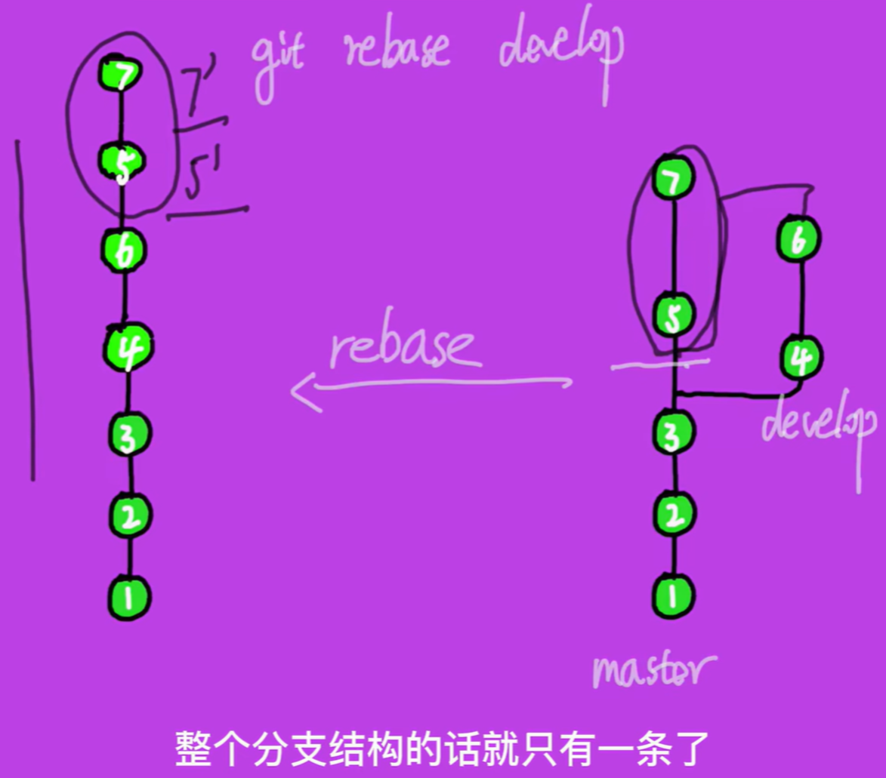

### 基本概念

<div class="one-image-container">
    
    <!-- <p>LoRA在Attention各部分权重上的消融实验效果</p> -->
    <!-- <figcaption>这是图片的标题或描述。</figcaption> -->
</div>

- 未跟踪区：Untracked
- 工作区：Workspace，Unstaged
- 暂存区：Staged，Index
- （本地）仓库区：Repository
- 远程仓库区：Remote

### 基本操作

- `git status`

## 仓库操作

### Untracked ⟷ Unstaged ⟷ Staged

#### `git add`

将工作区更新或未跟踪的文件添加到暂存区

```bash
git add file.txt
git add .               # 将当前目录下所有文件及文件夹添加至暂存区
```

#### `git restore`

把文件恢复成暂存区（或最后一次提交）的样子，丢弃工作区的所有改动，基本语法为 `git restore [OPTION] file_name`

Option

- `--staged` 只操作暂存区
- `--worktree` 默认操作，即对工作区和暂存区均进行改动，可不用显示写出

```bash
git restore file.txt                # 直接重置改动，重置为上一次Staged状态（无Staged状态则为最新一次提交状态HEAD）
git restore --staged file.txt       # 保留改动，只将文件由暂存区 → 工作区

# Staged → Unstaged → HEAD
git restore --staged --worktree file.txt
```

!!! info
    - `git restore` 默认操作Unstaged和Staged区域，不对Untracked区域做处理
    - `--staged` 只对暂存区文件做移出处理

#### `git rm`

将指定文件从暂存区移除（变为Untracked），基本语法为`git rm [OPTION] file_name`

Option

- `-f` --force，强制处理
- `-r` 递归处理文件夹中内容
- `--cached` 从暂存区中取消缓存，不物理删除文件
- `-n` --dry-run，不做任何移除操作，只是显示执行该命令有哪些文件会被从暂存区中移除

```bash
# rm + git add物理删除并提交删除记录
git rm file.txt

# 暂存区 → untracked
git rm --cached file.txt
```

#### `git clean`

用于删除未跟踪的文件和文件夹，基本语法为 `git clean [OPTION] file_name`

Option

- `-n` --dry-run 预览模式，仅显示什么文件会被删
- `-f` --force 强制删除，不加该参数无法真正实现删除
- `-d` 删除文件夹
- `-x` 连 ignored 文件一起删除
- `-X` 只删 ignored 文件，保留其他未跟踪文件
- `-i` --interactive 交互式，逐个删除确认

> ignored文件指的是.gitignore中指定的文件

```bash
git clean
git clean -df
```

#### `git reset`

将暂存区的文件还原到工作区，将暂存区指定文件状态回退

| 模式 | Index | WorkSpace | 危险性 |
| :---: | :---: | :---: | :---: |
| `--soft` | 不改变 | 不改变 | 低 |
| `--mixed` | 重置 | 不改变 | 中 |
| `--hard` | 重置 | 重置 | 高 |

```bash
<!-- 将缓存区(指定文件)回退至指定版本提交状态 -->
git reset (--mixed) (HEAD)
git reset HEAD~n                        # 回退至上n个版本
git reset <commit-hash>
git reset <commit-hash> <file_name>     # 撤销文件缓存
```

#### `git stash`

将工作目录和暂存区的修改（即“脏”状态）整体保存起来，然后将工作目录恢复到一个干净的、与上一次提交（HEAD）一致的状态，包括以下子命令

=== "git stash push"
    贮藏当前工作目录和暂存区的修改，并将工作区恢复至与 HEAD 提交一致的状态，
    ```bash
    git stash                       # 贮藏所有脏状态文件
    git stash push -- file_name     # 仅贮藏 file_name
    git stash push -- . :!file_name # 仅不贮藏file_name。 (+). (-):!file_name
    ```
=== "git stash list"
    显示所有贮藏的条目列表，基本语法为 `git stash list [Options]`

    Option

    - `--stat` 显示每个贮藏项中修改的文件名及变更行数

    ```bash
    git stash list
    git stash list --stat
    ```

=== "git stash show"
    显示指定贮藏条目中记录的文件变更摘要或详细差异。基本语法为 `git stash show [-u | --include-untracked | --only-untracked] [<diff-options>] [<stash>]`

    - `-u` --include-untracked，额外显示未跟踪文件
    - `{++--only-untracked++}` 仅显示未跟踪文件的差异，忽略已跟踪文件的修改。

    Diff-Option

    - `-p` --patch，展开显示完整的逐行代码差异（即具体的增删内容），类似于 `git diff`
    - `{++--stat++}` 显示改动统计摘要
    - `--name-only` 只显示改动文件名

    ```bash
    git stash show -p
    git stash show --name-only stash@{1}
    git stash show -u stash@{3}
    ```

=== "git stash apply/pop"
    将指定的贮藏内容恢复到工作目录，但保留/删除该贮藏条目，基本语法为 `git stash pop/apply [--index] [-q] [<stash>]`

    - `-q`：--quiet，静默模式，不输出应用成功的提示信息。
    - `--index`：暂存的恢复至暂存区，未暂存的恢复至工作区。未指定时均恢复至工作区
    
    ```bash
    git stash apply/pop
    git stash apply/pop stash@{3}
    ```

=== "git stash drop"
    从列表中移除指定的贮藏条目，基本语法为 ` git stash drop [-q|--quiet] [<stash>]`

    - `-q`：--quiet，静默模式，不输出应用成功的提示信息。

    ```bash
    git stash drop
    git stash drop stash@{3}
    ```

=== "git stash clear"
    删除所有的贮藏条目，基本语法为 `git stash clear`

!!! info
    - `git stash` 不带任何子命令时，默认执行 `push` 操作
    - `<stash>`：指定要应用的贮藏引用（如 stash@{1}），默认为最新的 {++stash@{0}++}。

### Staged ⟷ 本地仓库

#### `git commit`

将暂存区的改动永久保存到本地仓库，形成一条可追溯的历史记录。基本语法为 `git commit [OPTION] [commit message]`

Option

- `-m "commit message"`
- `-a` --all，自动暂存所有已跟踪文件的修改
- `--amend` 修改上一次提交（改commit message或补文件）
- `--no-verify` 强制提交，跳过pre-commit检查等钩子

```bash
git commit -am "commit message"         # 快速提交已跟踪文件改动

# --amend # 
git commit --amend -m "commit message"  # 修改最近一次提交的commit message & 补文件
git commit --amend --no-edit            # 补文件

git commit --no-verify -m "commit message"
                                        # 强制提交，跳过检查
```

!!! info
    如果最新一次提交已经推送到远程仓库：
    1. 本地使用 `--amend` 修改提交信息后，的本地仓库SHA就和远程仓库SHA不一致，导致冲突
    2. 需使用 `git push --force` 或更安全的 `git push --force-with-lease` 来强制推送，用本地的新提交覆盖远程的旧提交。
    > 使用 `git push --force-with-lease` 需--amend前的HEAD与远程仓库HEAD一致才可成功

### 本地仓库 ⟷ 远程仓库

#### `git remote`

`git remote` 命令是 Git 中用于管理本地仓库与远程仓库之间连接的核心工具，主要有以下常用语法

=== "-v"
    详细地列出所有远程仓库的简称及其对应的fetch（拉取） 和push（推送） URL
    ```bash
    git remote -v
    > origin  https://github.com/xcluo/xcluo.github.io.git (fetch)
    > origin  https://github.com/xcluo/xcluo.github.io.git (push)
    ```

=== "add"
    主要用于将本地仓库与远程代码仓库关联起来，以便进行代码的推送（push）和拉取（pull）等协作操作。基本语法为 `git remote add <仓库别名> <仓库URL>`，其中

    - 仓库别名：在本地为远程仓库指定的一个简短名称，可自定义，一般命名为origin
    - 仓库URL：远程仓库的地址，支持 HTTPS、SSH 协议或本地绝对/相对路径

    ```bash
    git remote add origin https://github.com/username/repo.git
    git remote add local-repo ../my-other-repo
    ```

=== "rename"
    用于修改本地仓库中已经配置的远程仓库别名。基本语法为 `git remote rename <旧别名> <新别名>`
    ```bash
    git remote rename origin xcluo
    ```

=== "set-url"
    用于修改本地仓库中已配置的远程仓库的 URL 地址。基本语法为 `git remote set-url [OPTION] <远程仓库别名> <新的URL>`

    Option

    - `--push` 所有选项均会有该默认选项，可不用指定，表示对 push 操作生效
    - `--add` 向同一个别名新增 URL，实现执行一次 git push 时同时推送到多个仓库
    - `--delete` 专门用于删除某个远程仓库别名下配置的特定 URL。

    ```bash
    git remote set-url --push origin git@new-host:u/repo.git
    git remote set-url --add --push origin https://backup-host/repo.git
    git remote set-url --delete origin https://old-host.com/repo.git
    ```

#### `git push`

#### `git pull`

#### `git clone`

拉取指定分支

`git clone -b <branch_name> <git_url of SSH/HTTP>`

## 分支操作

#### `git branch`

```bash
git branch                      # 查看本地分支信息
git branch -r                   # 查看远程分支信息
git branch -a                   # 查看本地分支和远程分支
git branch -m <new_branch_name> # 重命名当前分支
git branch -M <new_branch_name> # 重命名当前分支并强制覆盖已有分支（若重名）

git branch <new_branch_name>    # 创建但不切换至新分支

# 删除本地分支, 不能删除当前分支
git branch -d branch_name       # 普通删除分支
git branch -D branch_name       # 强制删除分支

# 删除远程分支
git push origin --delete remote_branch_name

git branch -vv                 # 查看本地分支和远程分支关联情况
git branch --unset-upstream     # 解除当前本地分支远程分支的关联
git branch --set-upstream-to=origin/<new_remote_branch_name>
git branch -u origin/<new_remote_branch_name>
                                # 将当前本地分支关联到新的目标远程分支
```

#### `git checkout`

```bash
# 以parent_branch_name为父分支生创建新的本地分支new_branch_name
# origin/remote_branch_name，使用远程分支作为父分支
git checkout -b <new_branch_name> <parent_branch_name>
git checkout -b <branch_name> <sha> # 将某次提交结果作为新分支并创建新分支
git checkout -b <new_branch_name>   # 创建并切换至新分支，默认父分支为当前分支
git checkout <branch_name>          # 切换至指定分支
git checkout -                      # 切换至上一分支
```

#### `git merge`

```bash
git merge <merged_branch_name>          # 将目标分支合并至当前分支
git merge --no-ff <merged_branch_name>  # ff: fast-forward，默认参数值
git merge --abort                       # 合并时发生冲突，终止合并

# 常用命令
git merge local-repo/master             # 合并远程仓库中指定分支，注意使用"/"分隔而不是空格" "
```

> 修改完冲突后, 通过add冲突文件 + `git commit`即可继续完成合并

#### `git diff`

- `git diff hash_1 hash_2`
- `git diff hash_1 hash_2 -- target_file`

#### `git rebase`

git rebase 的核心作用是将当前分支的提交“重放”到目标分支的最新提交之后，从而形成一条线性的提交历史。

<div class="one-image-container">
    
    <!-- <p>LoRA在Attention各部分权重上的消融实验效果</p> -->
    <!-- <figcaption>这是图片的标题或描述。</figcaption> -->
</div>

```bash
git rebase <rebased_branch_name>    # 将当前提交重放到rebased_branch_name分支提交之后
```

#### `git archive`

仓库中的指定文件或目录打包成一个（不包含 .git 目录）的归档文件，基本语法为 `git archive [--format=<fmt>] [--prefix=<pfx>/] [<tree-ish>] [<path>...]`

Option

- `--format=<fmt>` 指定输出格式：tar（默认）、zip
- `--prefix=<prefix>/` 为归档内所有文件添加一个顶级目录前缀，即项目根目录名
    > `<prefix>/f` 最后的/表示项目根目录文件夹名

- `-o <file>` --output，指定输出文件名，而非输出到标准输出。
- `--add-file=<file>` 额外添加untracked文件到归档中

```bash
# 将项目最新状态导出为.zip归档
git archive --format=zip --output=project_name.zip HEAD
```

### 日志相关

### 配置文件

### 常用git仓库

1. github  
2. gitlab
