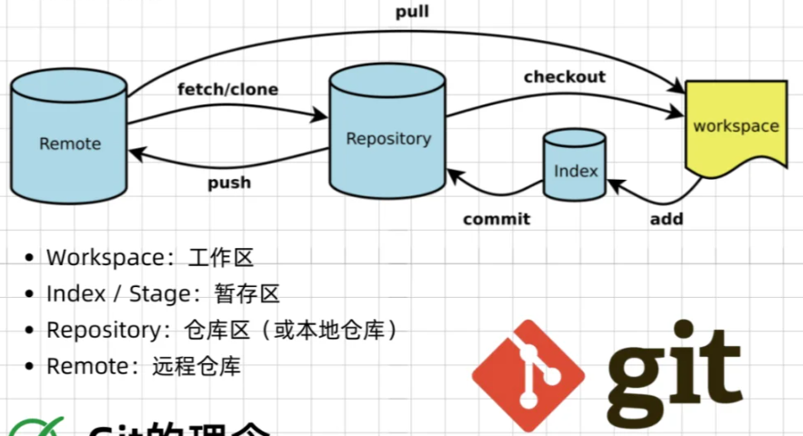

### 基本概念
<div class="one-image-container">
    
    <!-- <p>LoRA在Attention各部分权重上的消融实验效果</p> -->
    <!-- <figcaption>这是图片的标题或描述。</figcaption> -->
</div>

### 基本操作
- `git status`

### 仓库操作
#### 工作区 ⟷ 暂存区
1. `git add`，将工作区更新的文件添加到暂存区
2. `git reset`，将暂存区的文件还原到工作区，将暂存区指定文件状态回退

    | 模式 | Index | WorkSpace | 危险性 |
    | :---: | :---: | :---: | :---: |
    |  `--soft`| 不改变 | 不改变 | 低 |
    | `--mixed`| 重置 | 不改变 | 中 | 
    | `--hard` | 重置 | 重置 | 高 | 

    ```git
    <!-- 将缓存区(指定文件)回退至指定版本提交状态 -->
    git reset (--mixed) (HEAD)
    git reset HEAD~n                        # 回退至上n个版本
    git reset <commit-hash>
    git reset <commit-hash> <file_name>
    ```

3. `git rm`，将指定文件从暂存区移除

    ```git

    ```
#### 暂存区 ⟷ 本地仓库

#### 本地仓库 ⟷ 远程仓库

### 分支操作

### 日志相关

### 配置文件

### 常用git仓库
1. github  
2. gitlab