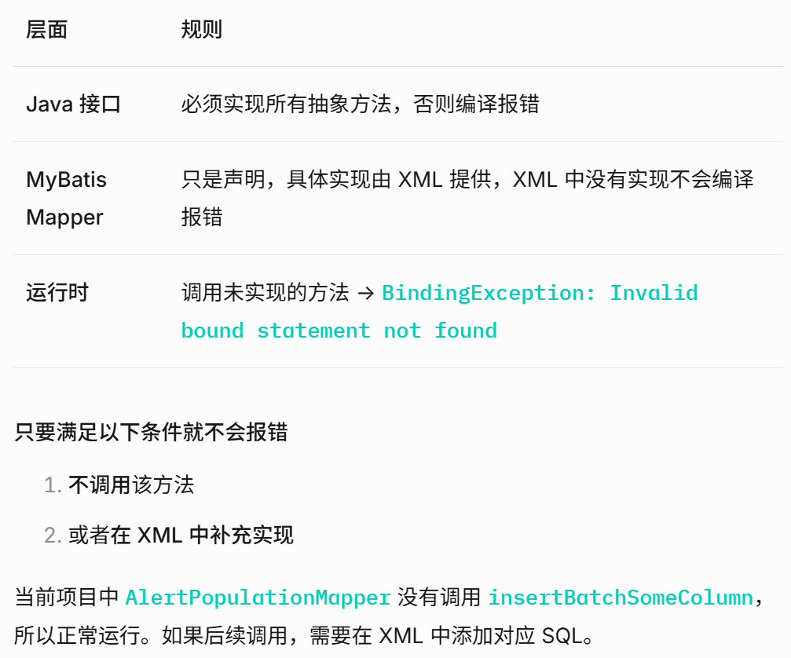

MyBatis 是一个优秀的持久层框架，它通过映射机制将 Java 对象与 SQL 语句关联起来，从而简化 JDBC 的繁琐操作。 MyBatis 映射机制包括以下三个层次

### 配置层

### 映射层

### 执行层

#### 映射关系建立

- 基于XML映射：在 XML 文件中定义 `<mapper namespace="com.example.to.UserMapper">`，接口的全限定名与 namespace 一致，方法名与 SQL 节点的 id 一致。  
- 基于注解：直接在接口方法上使用 @Select、@Insert 等注解，并编写 SQL。

只要满足以下两个关键点，MyBatis 就能自动将 Mapper 接口的方法调用映射到 XML 中定义的 SQL 并执行：

1. **XML 映射文件的 `namespace` 属性必须等于 Mapper 接口的全限定名**（例如 `com.example.mapper.UserMapper`）。
2. **XML 中 SQL 标签的 `id` 必须与接口中的方法名一致**（例如 `<select id="selectById">` 对应 `UserMapper.selectById` 方法）。

所以，只要配置正确，MyBatis 确实会帮你自动完成“方法调用 → SQL 执行 → 结果映射”的整个过程。

#### 结果映射

MyBatis 将查询结果集自动映射到 Java 对象：

- 自动映射：如果列名与属性名匹配（可开启驼峰转换），直接赋值。

#### 参数映射

MyBatis 将 Java 方法参数映射到 SQL 中的占位符 #{}（预编译）或 ${}（直接替换）。支持简单类型、Map、POJO 等。

- `@Param("req")` 参数注解，可以在xml文件中使用`#{req.paramName}` 引用参数中的数值，不加的话直接 `#{paramName}` 可能会导致参数绑定错误。
- 字段名 → 属性名 映射规则
- `<resultMap>`：自定义映射规则，处理复杂对象、关联对象、集合等。

#### 动态 SQL

通过 `<if>, <where>, <foreach>` 等标签，实现灵活的条件拼接，避免 SQL 注入。

MyBatis 的 Mapper 中定义的接口可以不在xml文件中实现，只要未调用该方法便不会报错，本质上

1. MyBatis 动态代理 自动生成interface方法实现类
2. 根据实现类和xml文件绑定关系
3. 当调用sql语句，如果绑定关系不存在，则报错  
> 因此未调用该方法，即使不绑定，也不会报错。

