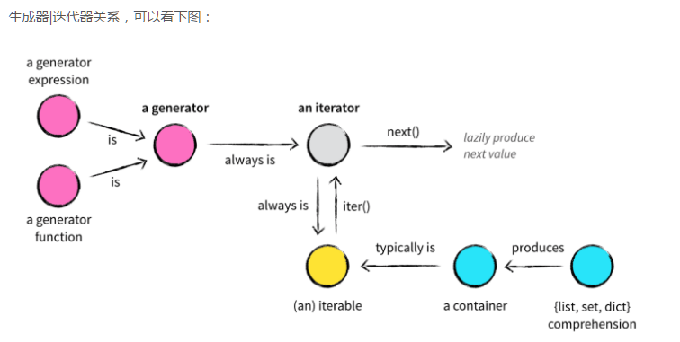

### 可迭代对象间的关系

<figure markdown>
  {width=80%}
  <figcaption>生成器/迭代器/可迭代对象关系图</figcaption>
</figure>

[`Generator`](#generator)派生出[`Iterator`](#iterator)，[`Iterator`](#iterator)派生出[`Iterable`](#iterable)

- 只有 `Iterable` 可以通过内置函数 `len` 访问容器元素个数
- `Iterator` 和 `Generator`只能通过内置函数 `next` 或迭代方法遍历元素
- `Iterator` 可通过内置函数 `iter` 生成一个 `Iterator`
- `Iterable` 和 `Generator` 是消费型的，每遍历一次都会更新状态，即链表；而 `Iterable` 是恒定的，即数组。

### `Iteratable`
### `Iterator`
### `Generator`