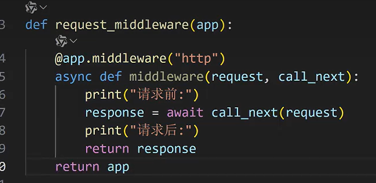

```bash
pip install fastapi[standard]
pip install uvicorn  
```

```python
from fastapi import Path, Query
from fastapi import WebSocket, WebSocketDisconnect
```


### 查看网页服务
- `F12 → 网络 → 点击对应的名称，查看返回信息`

- 主要是编写接口服务，`@app.get()`一般返回json格式数据
-  使用 Pydantic 数据验证库，通过python类型提示，更方便开发效率更高
- 基于 Starlette 异步Web框架
- ASGI (Asynchronous Server Gateway Interface) Uvicorn支持高并发请求
- 内置Swagger UI(docs)和ReDoc(redoc)，自动是生成交互式API文档
- FastAPI() 是应用的主体，而 APIRouter() 是应用的模块化组件
- 起服务
    - `uvicorn file_name:app_name --reload`
    - `fastapi dev file_name.py` 调试fastapi代码
    - `python file_name.py`
        ```python
        uvicrrn.run(
            app,
            *,
            host="127.0.0.1",
            port=8000,
            reload=False,           # 是否自动更新改动
            log_level=None,
        )
        ```

## 请求

### http请求

常见的请求如下

| 装饰器             | HTTP 方法 | 语义   | 典型用途           |
| --------------- | ------- | ---- | -------------- |
| `@app.get()`    | GET     | 获取资源 | 查询数据、搜索、获取列表   |
| `@app.post()`   | POST    | 创建资源 | 新增数据、提交表单、上传文件 |
| `@app.put()`    | PUT     | 全量更新 | 替换/更新完整资源      |
| `@app.delete()` | DELETE  | 删除资源 | 删除数据           |
| `@app.patch()`  | PATCH   | 局部更新、补丁 | 部分字段更新         |

### websocket请求

WebSocket 提供全双工通信能力，允许服务器与客户端建立持久连接，实现实时双向数据传输，常用于即时通讯、实时推送、在线协作等场景。

```python
from fastapi import FastAPI, WebSocket

app = FastAPI()

@app.websocket("/ws")
async def websocket_endpoint(websocket: WebSocket):
    await websocket.accept()
    try:
        while True:
            data = await websocket.receive_text()
            await websocket.send_text(f"收到: {data}")
    # 客户端主动断开
    except WebSocketDisconnect:
        print("连接关闭")
        await websocket.close()
    except Exception as e:
        print(f"发生错误: {e}")
        await websocket.close(code=1011)
```

#### 常用方法

=== "建立连接"
    接受并建立websocket连接
    ```python
    await wb.accept()
    #实际上触发 wb.send({"type": "websocket.accept"}) 以建立连接
    ```
=== "接收消息"
    接收消息，常规接收使用`while True`死循环接收，迭代接收使用`async for`异步循环接收
    ```python
    # 接收信息
    await wb.receive()

    # 接收文本消息， `receive_text | text_type`
    await receive_text()
    iter_text()         # async_iterator

    # 接收bytes消息，`receive_text | bytes_type`
    await receive_bytes()
    iter_bytes()        # async_iterator

    # 接收json消息，`receive_text | text_type or binary_type | json.loads`
    await receive_json(mode="text")
    iter_json()         # async_iterator
    ```
    
=== "发送消息"
    ```python
    # 发送消息
    await send(message: dict)

    # 发送文本消息，`text: data`
    await send_text(data: str)
    
    # 发送bytes消息，`bytes: data`
    await send_bytes()
    
    # 发送json消息，`json.dumps | text or bytes`
    await send_json(data, mode="text")
    ```

=== "关闭连接"
    关闭websocket连接
    ```python
    await wb.close(
        code:int = 1000,
        reason:str = None
    )
    # 实际上触发 wb.send({"type": "websocket.close"}) 以断开连接
    ```

#### 事件回调

- websocket.WebSocketApp
- 常用来作中继节点，将数据流转移至其它ws服务，如`客户端 → 被访问服务器（FastAPI） → 真实服务器`

### 参数相关

#### 路径参数

路径参数常渲染作url的一部分，即`url=prefix_url/{path_param}/suffix_url`，因此常通过渲染至url中进行参数传递

=== "常规写法"
    ```python
    @app.get/post/put/delete/patch("/xcluo/{item_id}")
    def read/create/update/delete_item(
        item_id: int,                       # 路径参数，path parameter
    ):
        return {"item_id": item_id}
    ```

=== "标准写法"
    ```python
    from fastapi import Path
    
    '''# 相关形参 #
    - 初始值: `default=...`
    - 数值相关形参: 
        - 数值大小: `gt, ge, lt, le`
    - 字符串相关形参: 
        - 字符串长度: `min_length, max_length`
        - 正则匹配: `pattern, regex`, 建议使用前者
    - `description: str` 路径参数的描述信息
    - `deprecated` 该路径参数是否已被弃用
    '''

    @app.get/post/put/delete/patch("/xcluo/{item_id}")
    def read/create/update/delete_item(
        item_id: int = Path(..., description="对象id")
    ):
        return {"item_id": item_id}
    ```


 好的，以下是参照你的路径参数格式生成的查询参数笔记：

---

#### 查询参数

查询参数常渲染作url的查询字符串，即`url=base_url?p1=v1&p2=v2`，有两种常用传入方式:

1. 手动拼接：即在url后 + `?p1=v1&p2=v2`
2. 自动渲染，如指定`requests`中的`params`参数

=== "常规写法"
    ```python
    @app.get/post/put/delete/patch("/xcluo/")
    def read_item(
        item_id: int,                       # 查询参数，query parameter
    ):
        return {"item_id": item_id}
    ```

=== "标准写法"
    ```python
    from fastapi import Query

    '''# 相关形参 #
    - 初始值: `default=...` 或具体值
    - 数值相关形参: 
        - 数值大小: `gt, ge, lt, le`
    - 字符串相关形参: 
        - 字符串长度: `min_length, max_length`
        - 正则匹配: `pattern, regex`, 建议使用前者
    - `description: str` 查询参数的描述信息
    - `deprecated` 该查询参数是否已被弃用
    '''

    @app.get/post/put/delete/patch("/xcluo")
    def read_item(
        item_id: int = Query(None, description="对象id")
    ):
        return {"item_id": item_id}
    ```

#### 请求体

- 请求体只能通过json字段传入
- 除手动外，查询参数只能通过params字段传入

`from fastapi import Body`
```python
requests.post(
    url,            # 通过指定目标url调用相应的请求体函数
    json=None,      # 传入的json格式数据
)

```
- `from enum import Enum`
- 传递方式:直接访问页面;通过本地代码访问

- 自定义验证规则:`typing + pydantic`
- `from pydantic import Field` 搭配BaseModel进行参数验证
- 表单数据类型:`from fastapi import Form` `user_name: str = Form(...)`, 引发`-H application/x-www-form-urlencoded` 而不是`application/json`, 查询参数此时不会出现在url处而是在数据 `-d` 处


#### 响应体

```python

class LXC(BaseModel):
    name: str
    age: int
    goods: list[str] = []

@app.get("/", response_model=LXC)
def lxc():
    # return LXC(name="xcluo", age=18)
    return {"name": "xcluo", "age": 18, "goods": []}
# - reponse_model限定返回的数据类型, 返回为json时会自动转型为BaseModel格式(要求json数据字段集大于等于BaseModel字段集合),因此两种方式均可
# - response_model_exclude_unset, 不返回未设值的字段(即不返回未设值的字段), 本质上与dict兼容
# - response_model_exclude_defaults
# - response_model_exclude_none
```

#### DI依赖注入

#### BackgroundTasks后台任务

### 请求处理扩展

#### Lifespan

生命周期事件

#### 异常处理器

@app.exception_handler(ValueError)

#### Middleware中间件

- `@app.middleware`: 中间件, 在client和server中间, `client ⟷ middleware ⟷ server`, 中间件是当前api所有接口通用的,且都要执行
- **中间件调用顺序**:根据中间件声明顺序即`client`至`server`流程中的调用顺序,类比于递归调用理解
- `app.add_middleware()` 自定义中间件

- `app = request_middleware(app)` 一定需要赋值么？


#### 请求体

#### 文件上传

- `pip install python-multipart`,`from fastapi import File, UploadFile` 上传文件
- `file: bytes=File(...)`,上传表单数据,docs中会自动出现选择文件button, 文件数据内容会存在`-F`中
- `file: UploadFile` 大文件上传(默认异步), 可通过`file.filename`获取上传文件名,常需搭配`async def ... await` 使用
- `import aiofiles` 异步打开文件 `async witha iofiles.open()`, 时间戳 (14, 18:00)
- `import asyncio`

- 上传多个文件`files: List[UploadFile] = File(...)`

#### requests

- 前部参数：通过路径渲染传递
- 中部参数：通过请求体传递
- 后部参数：可通过Depends依赖注入确定
- `from fastapi import HTTPException` 返回
- 服务器响应码,`{1: 信息响应,已接收,正在处理; 2: 成功响应; 3: 重定向; 4: client问题; 5: server问题}`
- `from fastapi import Request` 获取用户的request请求对象, 用于操控请求信息
- post接口需要定义request请求体


```python
# FastAPI和APIRouter均能进行include_router # 
app.include_router(
    router,
    prefix="",      # 为router设置的url前缀, 即 ip:port/suffix/path, 一般在各APIRouter中设置较为方便
    tags=[],        # 路由标签注释
)
```

```python
class Result(           
    BaseModel,          # 继承 Pydantic 基类
    Generic[T]          # 声明为泛型类，T 是类型参数
    success: bool
    err_code: Optional[str] = None
    err_msg: Optional[str] = None
    data: Optional[T] = None

    @classmethod
    def succ(cls, data: T):
        return Result(success=True, err_code=None, err_msg=None, data=data)
)
Result[list]        # 指定 list 为类型参数
Result.succ("lxc")  # 不指定类型参数直接声明,等价于Result[str].succ("lxc")
```

### 响应类型response

#### 文件

- 客户端`requests.post(stream=True)` 表示流式读取

```bash
# StreamingResponse除了用于流媒体输出，也可用于AR型LLM的时许输出
from fastapi import Response, FileResponse, StreamingResponse

app = FastAPI()
@app.get("/custom-file"):
async def get_custion_file():
    info = b"file content"
    return Response(
        content=info,
        media_type="text/plain",    # {text/pain: 文本内容, application/pdf: pdf文件, }
        headers={"Content-Disposition": "attachment;filename='file.txt'"}
                                    # attachment表示立即下载
    )
    return Response(
        path=file_path,
        media_type="application/pdf",    # {text/pain: 文本内容, application/pdf: pdf文件, vedio/mp4: mp4文件}
        headers={"Content-Disposition": "attachment;filename='file.pdf'"}
                                    # attachment表示立即下载, filename表示默认文件名
    )
```

- `from fastapi.responses import HTMLResponse` 响应格式控制,将返回的结果按照什么格式渲染解析

- `from fastapi.staticfiles import StaticFiles`
- `app.mount`: 为网页地址挂载html前端


### APIRouter 业务划分

- `from fastapi import APIRouter`

### 依赖注入

- Dependence Injection (DI)
- 依赖注入`from fastapi import Depends` 在参数传递至目标函数前，先进行前置注入函数的处理

#### 路径级

- `@app.get(dependencies=[Depends(path_di_func)])` 函数注入
- 对于含传入参数的函数，可对传入各参数分别进行Depends注入
#### 路由级
影响当前apirouter下的所有路由
- `APIRouter(dependencies=[Depends(router_di_func)])`
- 注入函数的传入参数为`token: str = Header(...)`

#### 全局级

- `FastAPI(dependencies=[Depends(global_di_func)])`
- 注入函数的传入参数为`request: Request`

```python
class FastAPI:
    def __init__(self,
    lifespan: Optional[Lifespan[AppType]] = None,       # 管理应用生命周期，支持同步和异步两种写法（替代了on_startup/on_shutdown 钩子，具体通过yeild关键字分隔）
    middleware: Optional[Sequence[Middleware]] = None,
)

- 同步lifespan直接定义函数,异步需要借助修饰器@asynccontextmanager
```

- 同步lifespan直接定义函数,异步需要借助修饰器@asynccontextmanager
- fastapi BackgroundTasks
- @app.websocket


是嵌入在“江西省政务服务效能提升项目”大可研里，内容不用太多，写清楚整体功能介绍、每项功能点、提供功能清单、需要的环境等，做一个整体预算。预算内容那天跟周邯沟通了，你们对接一下？

