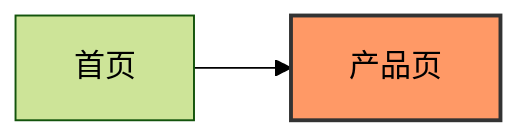
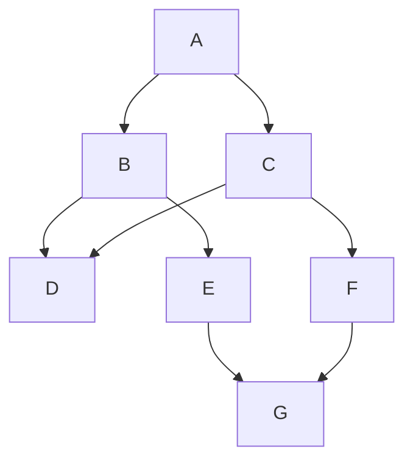
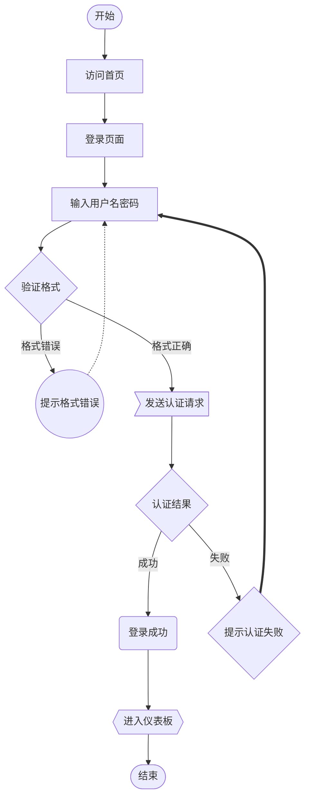
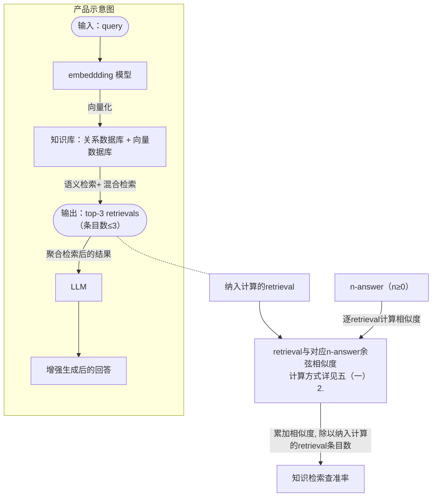

[mermaid](https://github.com/mermaid-js/mermaid)

## 流程图
### 基本语法
#### 图配置
- 流程图方向：`{TD/TB: 上下, BT: 下上, LR: 左右, RL: 右左}`
- 子图：子图间内容可互相连接
    ```
    subgraph graph_alias [graph_name]

    end
    ```
#### 节点相关
节点定义：可在连接时定义，也可以在连接前先完成定义  

- `alias((txt))`：圆形
- `alias(txt)`：圆角矩形
- `alias([txt])`：体育场矩形
- `alias[txt]`：矩形
- `alias[/txt/]`：左平行四边形
- `alias[\txt\]`：右平行四边形
- `alias[\txt/]`：倒等边梯形
- `alias[/txt\]`：等边梯形
- `alias{txt}`：菱形
- `alias{{txt}}`：六边形
- `alias>txt]`：非对称图形，图解为 `>二]`

#### 连接线
- `-->/<--` 实线右/左箭头连接
- `---` 实线无箭头连接
- `-.->/<-.-` 虚线右/左箭头连接
- `-.-` 虚线无箭头连接
- `==>/<==` 粗线右/左箭头连接
- `===` 实线无箭头连接
- `A --> B & C` 表示多连接，即A同时连接B和C
- `B & C --> A` 表示多连接，即B和C同时连接A
> - `>` 表示右箭头，`<`表示左箭头，可同时出现左右箭头
> - 对于实线和粗线连接，可通过增加`-/=`实现延长连接线功能

#### 相关配置
在`flowchart`之前
```
%%{init: {
    'theme': 'default',         %% {default, forest, dark, netural}
    'flowchart': {
        'useMaxWidth': true,    %% 自适应宽度
        'htmlLabels': true,     %% 启用html标签渲染，如<br>, <b>, <i>，字体大小，颜色格式等
        'curve': 'basis',       %% 设置连接线曲线类型，{basic: 直线, cardinal: 曲线, }
        'diagramPadding': 10,   %% 图表内容与整个画布边界间的距离
        'padding': 10,          %% 节点内文本与边框之间的空白距离（越大越远）
        'defaultRenderer': 'dagre-d3'
    }
}}%%

classDef red fill:#f96,stroke:#333,stroke-width:2px
```

- %% 这是注释
- 点击事件 click alias 



### 经典示例
- 多连接


- 多元素应用





## 时序图
sequenceDiagram
## 甘特图
gantt
## 类图
classDiagram
## 状态图
stateDiagram
## 饼图
pie
## git图
gitGraph
