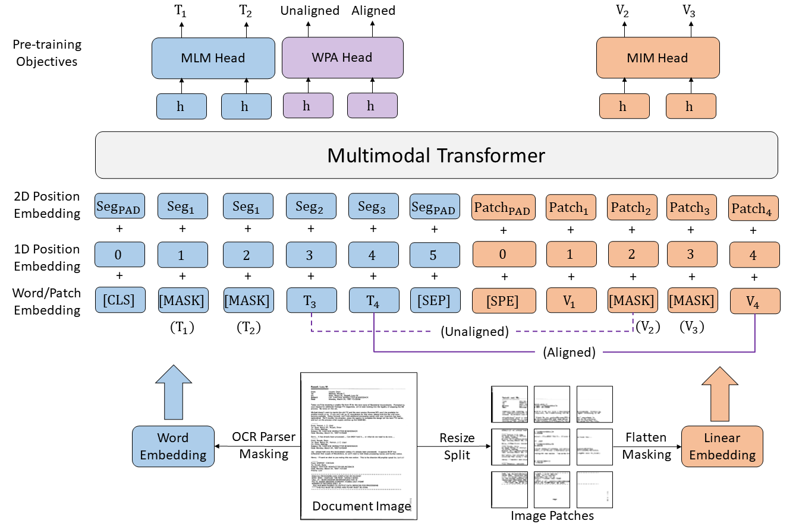

<!-- more -->
- 多模态模型[版面内容理解]：分类
- 图片分割 → 多模态模型[分类 + OCR]

---

1. 文件类型识别（LayoutLMv3），是资质文件 or 证书
1. 版面分割，指定内容分割（本质上是使用text对图片分割区域进行查询过滤）
> 框 + mask（框内有效像素点）
2. 具体部分专用采用模型识别
3. 多语种识别处理

### 版面分析，图像分割

#### [LayoutLMv3](https://github.com/microsoft/unilm/tree/master/layoutlmv3)

- 1D position embedding：token序列顺序
- 2D position embedding：token空间关系，即token所处页面位置坐标【文本边界框归一化后绝对坐标 (x0, y0, x1, y1)，图片网格坐标】

- MLM：masked language modeling
- MIM：masked image modeling
- WPA：word-patch alignment，图片网格文本内容还原

#### [SAM 3](https://github.com/facebookresearch/sam3)

#### 印章识别、多语种

- 印章检测与去除
- PaddleOCR
- GLM-OCR
- PP-OCRv4
- EasyOCR

#### VLM

- VLM: Visual Language Model，多模态大模型进行图片内容理解
- 图片内容是否与提交信息一致