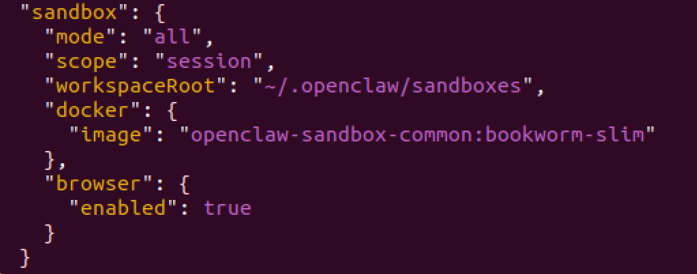

<!-- more -->
- [OpenClaw已跑通功能](https://www.yuque.com/ruishi-7yym8/mqxshg/qgcncafnwwziqq8k?singleDoc#GoZBP)
- [openclaw中文指南: docker, sandbox](https://news-openclaw.smzdm.com/docs/zh-CN/install/docker)
- [openclaw中文指南: nix](https://news-openclaw.smzdm.com/docs/zh-CN/install/nix)
- tools.elevated 提权是显式的"逃逸通道"，可让 exec 工具绕过 sandbox 直接在 Gateway 主机上执行，这也再次说明两者（Gateway 主机 和 Sandbox 容器）是相互独立的。

### 项目安装 

- windows中间安装中：ps1 脚本需去除 -T 伪终端选项

```bash
git clone https://github.com/openclaw/openclaw.git
cd openclaw

pnpm install
pnpm ui:build     # 构建前端ui，auto-installs UI deps on first run
pnpm build        # 构建执行脚本dist

# 选择GLM4.7 → 输入API_KEY → 选择GLM 4.7-flash
# API_KEY会存储在 .openclaw/agents/main/agent/auth-profiles.json中
# 默认会开启网关
pnpm openclaw onboard --install-daemon
```

### 常用命令

```bash
# 查看可用命令
pnpm openclaw help

# 启动（改命令会实时监控日志）
pnpm openclaw gateway --port 18789 --verbose
--allow-unconfigured
pnpm openclaw gateway stop  # 关闭网关

pnpm openclaw config    # 进行配置，ESC退出
pnpm openclaw skills    # 查看skills
pnpm openclaw dashboard # 启动浏览器页面
pnpm openclaw tui       # 终端对话


systemctl --user status # 查看当前用户网关情况
```


- 无法打开浏览器可以重启wsl：`wsl --shutdown`，等待10s后再`wsl`进入

### docker容器化

```bash
git clone openclaw
./docker-setup.sh
```

出现无法安装bun.sh时可采用以下替换方法 `RUN curl -fsSL https://bun.sh/install | bash`

1. 下载对应版本的bun.zip
2. 修改Dockerfile文件

```bash
# copy对应版本bun.zip进入容器
COPY bun-linux-x64.zip /tmp/bun.zip

RUN mkdir -p /root/.bun/bin && \
    unzip /tmp/bun.zip -d /tmp/bun-extract && \
    mv /tmp/bun-extract/*/bun /root/.bun/bin/ && \
    chmod +x /root/.bun/bin/bun && \
    rm -rf /tmp/bun.zip /tmp/bun-extract \
```

#### docker部署
```bash
docker build -t openclaw:local -f Dockerfile .
docker compose run --rm openclaw-cli onboard
docker compose up -d openclaw-gateway
```


- 默认非root的node用户安装 → USER root
- 增加安装的工具 → OPENCLAW_DOCKER_APT_PACKAGES="jq iputils-ping"

------

- 运行完cli
- openclaw.json，中-"gateway"子键新增，
```
"controlUi": {
  "allowInsecureAuth": true
},
```

cli 额外配置

```bash
docker compose run --rm openclaw-cli channels login
```


### openclaw.json

#### 网关
```json
"gateway": {
    "port": 18789,
    // {local, remote}
    "mode": "local",
    // {loopback, lan}
    "bind": "loopback",
}
```

#### 沙箱运行tool

- https://www.bilibili.com/video/BV158ZABkE5Q/?spm_id_from=333.788.videopod.sections&vd_source=782e4c31fc5e63b7cb705fa371eeeb78



```json
"sandbox": {
  // {non, non-main, all}
  "mode": "non-main",
  // {shared, agent, session}
  "scope": "agent",
  // {none, ro, rw}
  "workspaceAccess": "none",
  "docker": {
    // 指定镜像
    "image": "openclaw-sandbox-common:bookworm-slim",
    // {none, bridge}
    "workspaceRoot": "~/.openclaw/sandboxes",
    "network": "bridge",
    "user": "1000:1000",
    // 挂载卷, host_dir:container_dir:mode
    "binds": ["/home/node/.openclaw/workspace:/workspace:ro", "/var/run/docker.sock:/var/run/docker.sock"]
  },
  // 允许在sandbox中执行浏览器操作
  "browser": {
    "enabled": true
  }
}

// agents.list
"list": [
	  {
        "id": "vr-test",
        "name": "vr-test",
        // 指定沙箱工作区间
        "workspace": "~/.openclaw/workspace-vr-test",
        "sandbox": {
          "mode": "non-main",
          "scope": "agent"
        },
        "tools": {
          "allow": ["read", "exec", "edit", "write", "process", "browser"],
          "deny": [],
        }
      },
	  {
        "id": "build",
        "name": "build",
        "workspace": "~/.openclaw/workspace-build",
        "sandbox": {
          "mode": "non-main",
          "scope": "agent"
        },
        "tools": {
          "allow": ["read", "exec"],
          //"deny": ["exec", "write", "edit", "apply_patch", "process", "browser"]
        }
      },
	]

```


#### 多智能体
1. 修改.docker-setup.sh中`OPENCLAW_CONFIG_DIR`和`OPENCLAW_WORKSPACE_DIR`，放置写入覆盖
2. 修改`docker-compose.yaml`中端口映射放置端口拥挤
3. 实现部署

---
agents.list中可定义多智能体，类似于models中指定多llm


#### 使用自有大模型
```json
"models": {
  "providers": {
    "custom-1": {
      "baseUrl": "http://36.137.243.191:8002/v1",
      "apiKey": "<your_api_key>",
      "auth": "token",
      "api": "openai-completions",
      "headers": {},
      "authHeader": true,
      "models": [
        {
          "id": "XT-LLM",
          "name": "XT-LLM",
          "api": "openai-completions",
          "reasoning": true,
          "input": [
            "text"
          ],
          "contextWindow": 40000,
          "maxTokens": 40000,
          "cost": {
            "input": 0,
            "output": 0,
            "cacheRead": 0,
            "cacheWrite": 0
          }
        }
      ]
    }
  }
}

// 一定要提供provider，该provider对应新增的供应商键值
agents.defaults."primary": "{==custom-1==}/XT-LLM"
```


#### docker配置飞书
依照教程进行

## OrangePi安装

### docker部署

#### 改写Dockerfile

1. `RUN curl -fsSL https://bun.sh/install | bash` → 先下载指定（arm）版本后安装

```
COPY bun-linux-aarch64.zip /tmp/bun.zip

RUN mkdir -p /root/.bun/bin && \
    unzip /tmp/bun.zip -d /tmp/bun-extract && \
    mv /tmp/bun-extract/*/bun /root/.bun/bin/ && \
    chmod +x /root/.bun/bin/bun && \
    rm -rf /tmp/bun.zip /tmp/bun-extract \
```

## Skills

- [openclaw skill hub](https://clawhub.ai/skills?sort=downloads)

## 远程访问openclaw服务

1. openclaw.json：
    - `mode: remote`，此时启动gateway时需传入参数`--allow-unconfigured`
    - `bind: lan`
    - `controlUi`
        - `allowInsecureAuth: true`
2. 远程机器浏览器中（首次）输入 `http://部署机器IP:端口号port_num/#token=真实token`

> docker部署一定要保证宿主机和容器成功配置端口映射


